# TP7: Code Coverage, Análisis Estático y Pruebas de Integración

## Alumnos: Juncos Bautista y Treachi Belén.

[RepoEnAzure-TP7-JUNCOS-TREACHI](https://baujuncos@dev.azure.com/baujuncos/TP7_CodeCoverage_IS3/_git/TP7_CodeCoverage_IS3)

## Prerequisito: Agregar Code Coverage a nuestras pruebas unitarias de backend y front-end e integrarlas junto con sus resultados en nuestro pipeline de build.

Esto ya lo realizamos en el TP6, pero debimos incluir muchos tests más para aumentar el porcentaje de cobertura de lineas y logramos el siguiente:
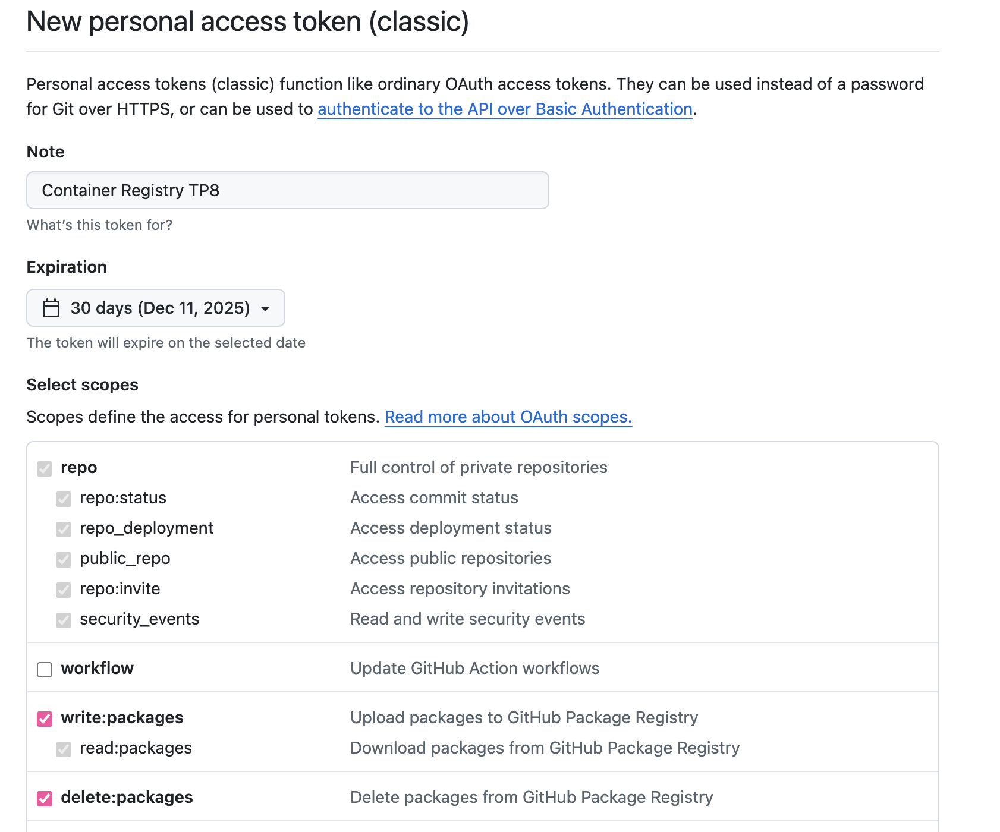

## Agregamos Análisis Estático de Código con SonarCloud

### Seguimos el instructivo para configurar SonarCloud:

1. **Navegamos a:** https://www.sonarsource.com/products/sonarcloud/

2. **Hacemos Sign Up con nuestra cuenta de AzureDevOps**

3. **Importamos una organización**

* Nombre: baujuncos
* PAT: lo creamos en Project  (home)

* Copiamos el PAT creado:

* Lo copiamos en SonarCloud para terminar de configurar la organización con Plan Free:

* **Seleccionamos nuestro proyecto del TP7:**

* **Creamos el proyecto:**

* **Seleccionamos el método de análisis que implementaremos: Azure DevOps Pipelines**

4. **Instalamos extensión en Visual Studio usando nuestra organización**

* **Corroboramos la instalación ya en AzureDevOps -> Organization Settings -> Extensions:**

5. **Seguimos instrucciones para agregar SonarQube Cloud Service Endpoint**

* **Hacemos el token de manera manual desde My Account -> Security:**

* **Pegamos el token, verificamos, le ponemos nombre a la Service Connection y GUARDAMOS:**

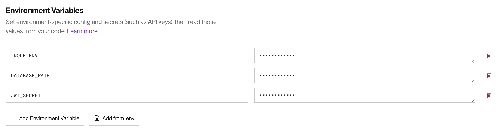

* **Service Connection creada con éxito:**

6. **Configuramos nuestro pipeline**

* **Seleccionamos la opción JS/TS & Web**:

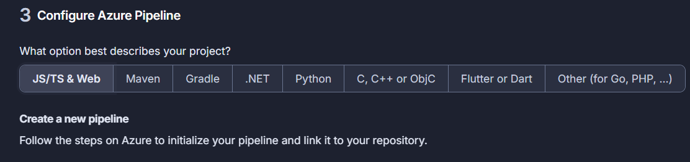

* **Seteamos Fetch Depth:** Azure Pipelines, por defecto, tienen habilitada la Clonación Superficial (Shallow fetch). Debemos establecer el valor de fetchDepth a 0 para anular esta configuración y habilitar la obtención de la información de la autoría (blame information).

Agregamos esto:

    `steps:
     - checkout: self
     fetchDepth: 0`

Queda así:

* **Colocamos una tarea de SonarCloud ANTES de nuestra tarea de Build que sería cuando hacemos "npm ci"**

* **Hacemos click en "Search tasks", buscamos "Sonar" y seleccionamos "Prepare Analysis Configuration":**

* **Rellenamos según las indicaciones que nos provee SonarCloud:**

* **Se agrega con éxito la task:**

* **Ahora colocamos una tarea de SonarCloud DESPUES de nuestra tarea de Build que sería cuando hacemos "npm ci"**

* **Hacemos click en "Search tasks", buscamos "Sonar" y seleccionamos "Run Code Analysis". Directamente clickeamos en Add y agregamos la Task:**

* **Agregamos otra Task a continuación pero esta vez debe ser de "Publish Quality Gate Result":**

* **Clickeamos en "Validate And Save":**

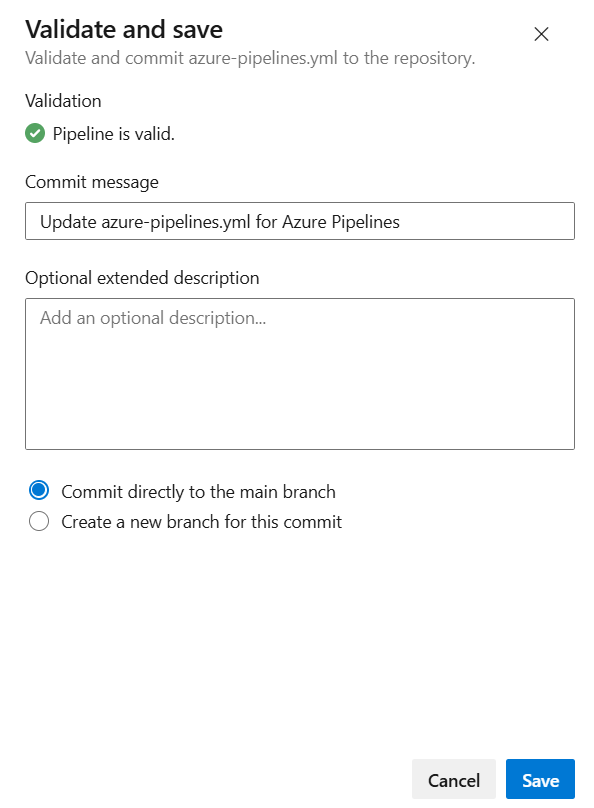

### Corremos nuestro nuevo pipeline que tiene análisis estático con SonarCloud:"

* **Vemos el resultado de nuestro pipeline, en extensions tenemos un link al análisis realizado por SonarCloud:**

* **Puntos más relevantes del informe, qué significan y para qué sirven:**

- La gran mayoría de los security hotspots con prioridad alta detectados vienen de los tests que realizamos donde las contraseñas no se encuentran hasheadas (y con toda la razón del mundo).

- Errores criptograficos que igualmente se encuentran en test.

- Los issues de mantenibilidad varían entre Low y Medium (impacto en mantenibilidad) aunque también detecto la palabra comentada "todo" como la palabra en inglés TO DO lo cual hace dudar de la credibilidad de los issues en sí.

- En Reliabiity solo hay 3 issues mientras que en mantenibilidad hay 95 issues.

- Las duplicaciones son del 2.4%.

- El QualityGate de SonarCloud fue Passed.

## Pruebas de Integración con Cypress

Cypress es una herramienta de pruebas tanto de integración como unitarias diseñada para probar aplicaciones web. Facilita la escritura, ejecución y depuración de pruebas automáticas en tiempo real dentro del navegador. A diferencia de otras herramientas de pruebas, Cypress se ejecuta directamente en el navegador, lo que le permite interactuar con la página web de manera más eficiente, proporcionando feedback rápido y detallado sobre las pruebas.

**Características clave de Cypress:**
* Pruebas en tiempo real: Ver los resultados de las pruebas en el navegador mientras se ejecutan.
* Automatización completa del navegador: Cypress controla el navegador para simular la interacción del usuario.
* Rápida retroalimentación: Ideal para desarrollo ágil con integración continua.
* Depuración sencilla: Acceso a capturas de pantalla y videos de las pruebas fallidas.

### En el directorio raiz de nuestro proyecto instalar el siguiente paquete: 

`npm install cypress --save-dev`

### Abrir Cypress

`npx cypress open`

### Inicializamos Cypress en nuestro proyecto

* **En la ventana del navegador que se abre hacer click en E2E Testing:**

* **Nos indica que creó una serie de archivos necesarios para el funcionamiento (hacemos click en Continue):**

* **Seleccionamos un browser y clickeamos en "Start E2E Testing in Chrome":**

* **Hacemos que nos cree una serie de pruebas de ejemplo:**

* **Seleccionamos una de las pruebas generadas:**

* **Cerramos la ventana de Cypress ya que terminamos de inicializarlo**

### Estructura de carpetas de Cypress:

* cypress/e2e: Aquí es donde se almacenan tus archivos de prueba.

* cypress/fixtures: Aquí se almacenan los datos de prueba que puedes usar en tus tests.

* cypress/support: Contiene archivos de configuración y comandos personalizados.

### Crear nuestra primera prueba navegando a nuestro front.

* **En la carpeta cypress/e2e, creamos un archivo con el nombre primer_test.cy.js y agregamos el siguiente código para probar la página de inicio de nuestro front:**

        `   describe('Mi primera prueba', () => {
            it('Carga correctamente la página de ejemplo', () => {
            cy.visit('https://webapp-tp05-qa-juncos-treachi-fqa5gug9addretfg.canadacentral-01.azurewebsites.net') // Colocar la url local o de Azure de nuestro front
            cy.get('h1').should('contain', 'TikTask') // Verifica que el título contenga "TikTask"
            })
        })`

* **Corremos nuestra primera prueba:** Si está abierta la interfaz gráfica de Cypress, aparecerá el archivo primer_test.cy.js en la lista de pruebas. Clic en el archivo para ejecutar la prueba.

También es posible ejecutar Cypress en modo "headless" (sin interfaz gráfica) utilizando el siguiente comando:

`npx cypress run`

* **Modificar nuestra prueba para que falle:** Editamos el archivo primer_test.cy.js y hacemos que espere otra cosa en el título. Ejecutamos cypress en modo headless.

**Cypress captura automáticamente pantallas cuando una prueba falla. Las capturas de pantalla se guardan en la carpeta cypress/screenshots.**

### Grabar nuestras pruebas para que Cypress genere código automático y genere reportes:

* **Editamos el archivo cypress.config.ts incluyendo la propiedad experimentalStudio en true y la configuración de reportería:**

* **Corremos nuevamente Cypress con npx cypress open, una vez que se ejecute nuestra prueba tendremos la opción de "Add Commands to Test". Esto permitirá interactuar con la aplicación y generar automáticamente comandos de prueba basados en las interacciones con la página:**

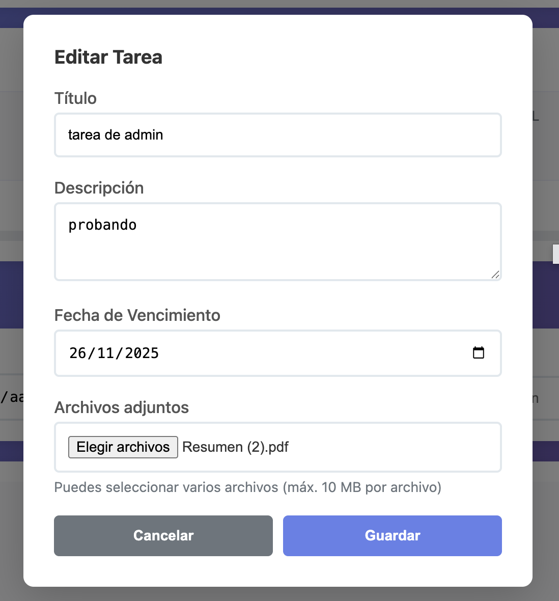

* **Si hacemos click en Save se guarda el código de la prueba en su archivo correspondiente dentro del proyecto:**

### Nuestras pruebas de integración en Cypress:

1. **Una simple para ver si nos carga la página:**

        `   describe('Mi primera prueba', () => {
            it('Carga correctamente la página de ejemplo', () => {
            cy.visit('https://webapp-tp05-qa-juncos-treachi-fqa5gug9addretfg.canadacentral-01.azurewebsites.net') // Colocar la url local o de Azure de nuestro front
            cy.get('h1').should('contain', 'TikTask') // Verifica que el título contenga "TikTask"
            })
        })`

**Resultado:**

2. **Login:**

        `   describe('Prueba de Login', () => {
            it('El login es exitoso', () => {
                cy.visit('https://webapp-tp05-qa-juncos-treachi-fqa5gug9addretfg.canadacentral-01.azurewebsites.net') // Colocar la url local o de Azure de nuestro front
                cy.get('h1').should('contain', 'TikTask') // Verifica que el título contenga "TikTask"
                cy.get('#loginUsername').click();
                cy.get('#loginUsername').type('admin');
                cy.get('#loginPassword').type('Admin123!');
                cy.get('#loginForm button.btn').click();
            })
        })`

**Resultado:**

3. **Registro de nuevo usuario y creación de Task con Descripción y Due date:**

        `    import { faker } from '@faker-js/faker';

            describe('Prueba de registro de usuario y creación de Task', () => {
            it('Task creada con éxito con usuario único', () => {
                // 1. Generar datos únicos (nuevo formato faker)
                const uniqueUsername = faker.internet.username();  // username random
                const uniqueEmail = faker.internet.email();        // email random
                
                cy.visit('https://webapp-tp05-qa-juncos-treachi-fqa5gug9addretfg.canadacentral-01.azurewebsites.net');
                
                cy.get('h1').should('contain', 'TikTask');
                cy.get('#showRegister').click();
                
                cy.get('#registerUsername').type(uniqueUsername);
                cy.get('#registerEmail').type(uniqueEmail);
                cy.get('#registerPassword').type('proyecto');
                cy.get('#registerForm button.btn').click();
                
                cy.get('#addTaskBtn').click();
                cy.get('[name="title"]').type('Estudiar para el final de economia');
                cy.get('[name="description"]').type('Es oral teorico');
                
                cy.get('[name="due_date"]').click();
                cy.get('[name="due_date"]').clear();
                cy.get('[name="due_date"]').type('2025-12-25');
                
                cy.get('#taskForm button.btn-primary').click();
            });
        });`

**Resultado:**

4. **Eliminación de Usuario desde la cuenta admin:**

        `    describe('Prueba de Login', () => {
            it('El login es exitoso', () => {
                cy.visit('https://webapp-tp05-qa-juncos-treachi-fqa5gug9addretfg.canadacentral-01.azurewebsites.net') // Colocar la url local o de Azure de nuestro front
                cy.get('h1').should('contain', 'TikTask') // Verifica que el título contenga "TikTask"
                cy.get('#loginUsername').click();
                cy.get('#loginUsername').type('admin');
                cy.get('#loginPassword').type('Admin123!');
                cy.get('#loginForm button.btn').click();
                cy.get('#manageUsersBtn').click();
                cy.get('#adminUsersList div:nth-child(1) > div.user-card-actions > button.btn-danger').click();
            })
        })`

**Resultado:**

### **Cypress corrido en headless:**

**Resumen:**

### **Integramos Cypress al pipeline pero no sin algunos problemas:**

**Ver en el pipeline la implementación**

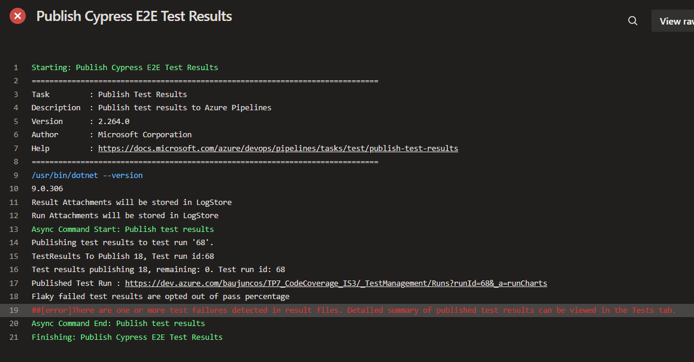

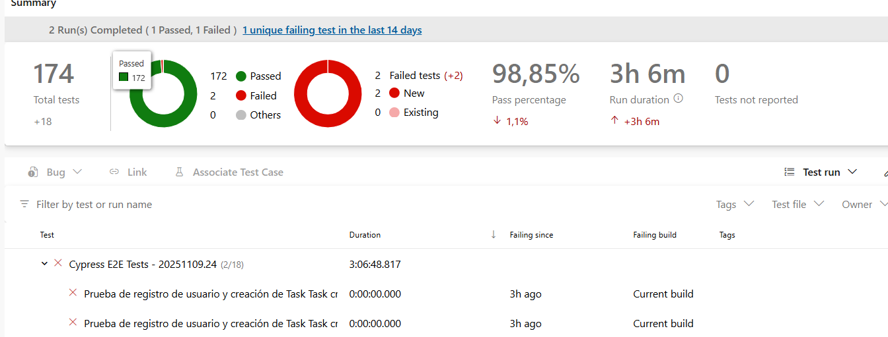

Detecta Fails en los tests de Cypress aunque hayan pasado correctamente los cuatro, entonces modificamos el codigo en el pipeline para sobrevivir falsos fallos y nos queda así:

          # 8-quinquies. PUBLISH CYPRESS TEST RESULTS
          - task: PublishTestResults@2
            displayName: 'Publish Cypress E2E Test Results'
            condition: succeededOrFailed()
            inputs:
              testResultsFormat: 'JUnit'
              testResultsFiles: 'cypress/results/*.xml'
              searchFolder: '$(System.DefaultWorkingDirectory)'
              mergeTestResults: true
              failTaskOnFailedTests: false     # evita que marque error por falsos negativos
              testRunTitle: 'Cypress E2E Tests - $(Build.BuildNumber)'
              publishRunAttachments: true

### **Ejecución exitosa de tests de integración de Cypress en Pipeline:**

* Instalamos dependencias:

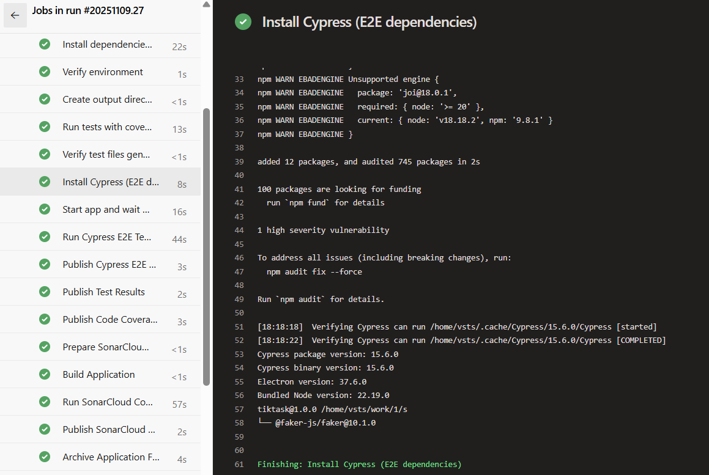

* Arrancamos la app:

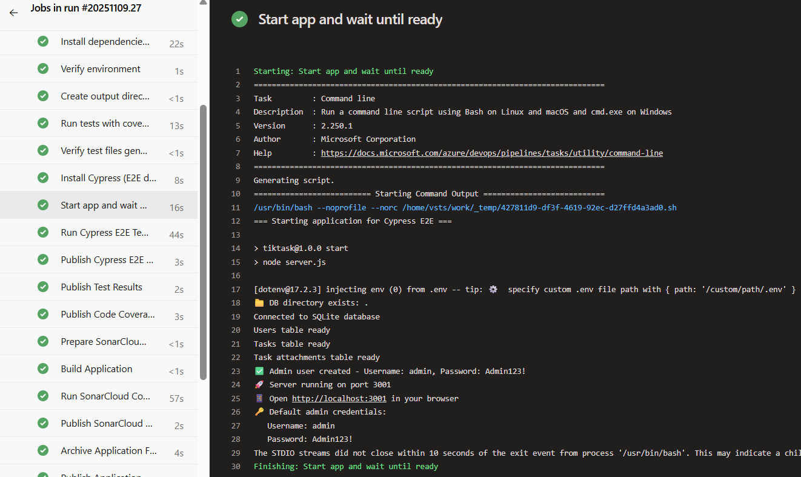

* Corremos en headless:

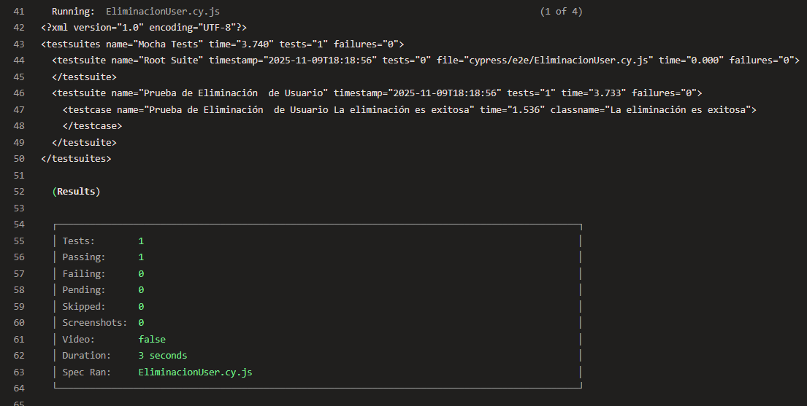

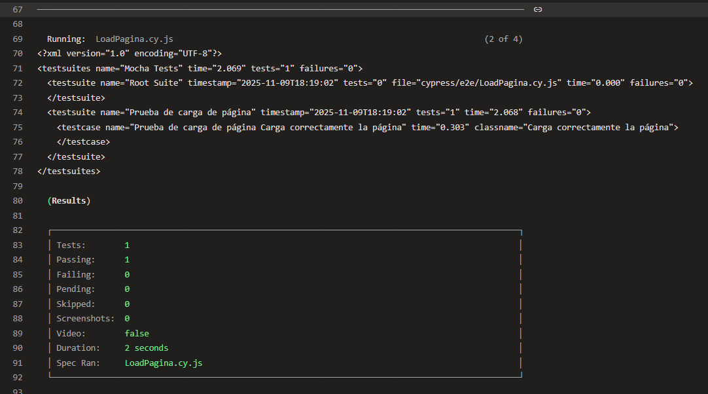

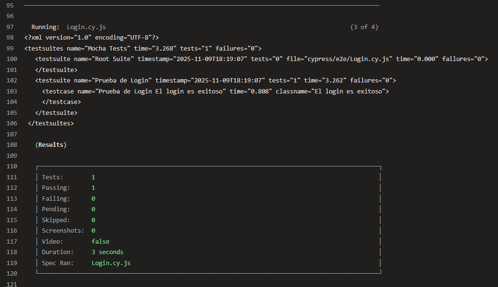

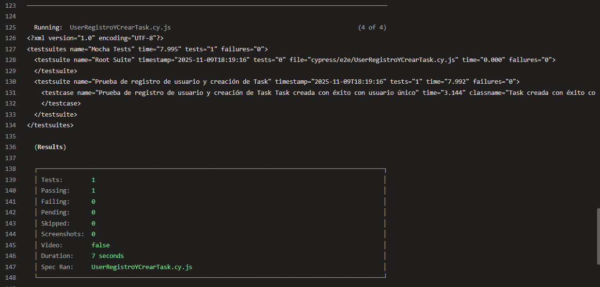

* Resumen de tests corridos:

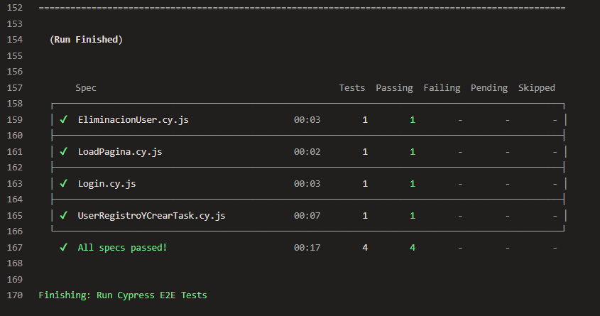

* Publicamos los resultados de Cypress:

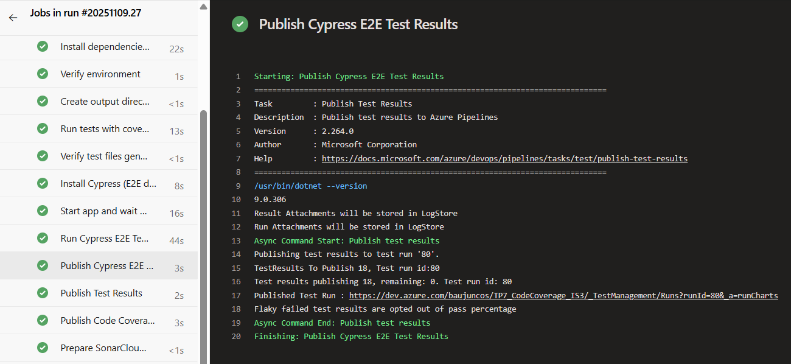

## Agregamos  un check del Quality Gate del Sonar EN NUESTRO PIPELINE que en nuestro caso es el predeterminado de Sonar:

**Esto lo que hace es chequear que pase el quality gate y si no lo pasa detiene el pipeline:**

Notar publish y luego el chequeo mencionado:

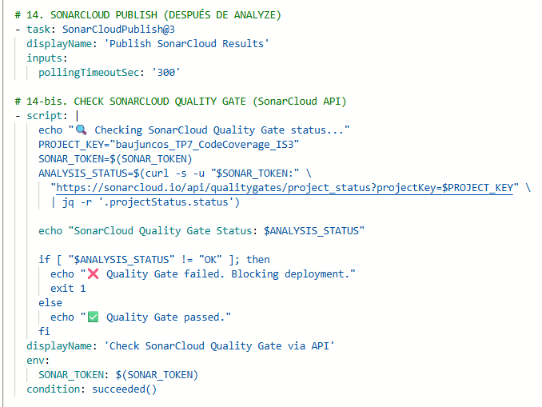

Para lograr que funcione debemos hacer uso de nuestro SonarToken que creamos casi al principio de este TP. Lo que hacemos es configurar una variable secreta de pipeline que utilice en todos los pipelines a partir de su creación:

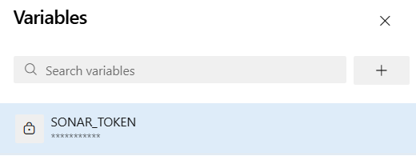

## Ejecución exitosa de pipeline final:

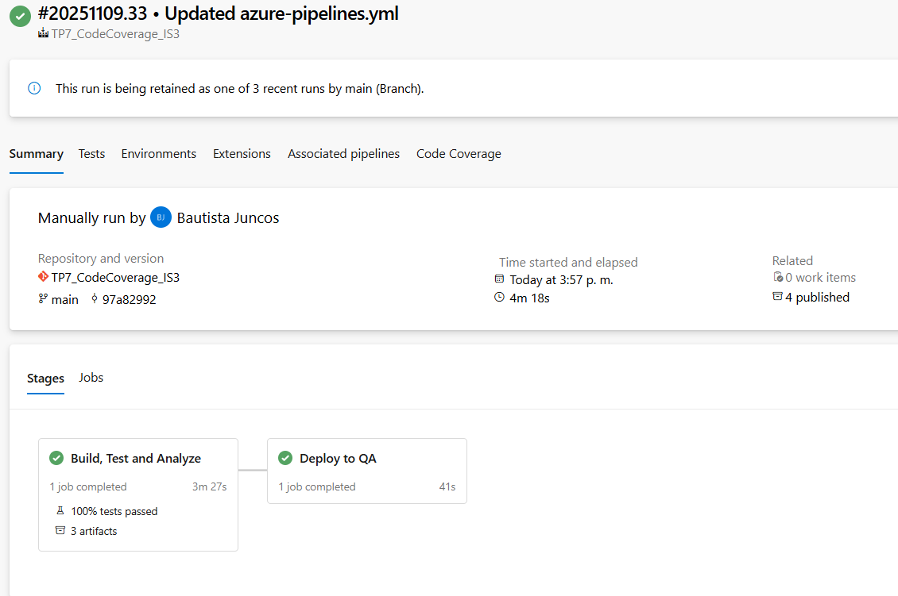

## ¿Cómo bloqueamos deploy si  las pruebas de integración (Cypress) fallan?

Esa línea hace que si cualquier test unitario o de Cypress falla,
el stage completo (Build_Test_Analyze) marca Failed →
y como nuestro deploy depende de succeeded(), no se ejecuta el stage DeployQA.

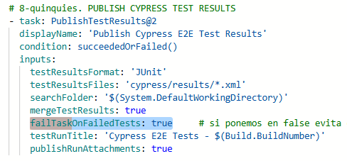

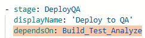

## ¿Cómo bloqueamos deploy si SonarCloud detecta issues críticos?

Está cubierto con nuestro Quality Gate API check. Ese paso revisa el estado general del Quality Gate, y el Quality Gate de SonarCloud incluye por defecto:

* No tener issues críticos o bloqueantes.

* No tener bugs severos o vulnerabilidades.

* Mantener cobertura mínima y duplicaciones bajas.

## ¿Cómo bloqueamos deploy si la cobertura es menor al 70%?

Hacemos un control en el mismo pipeline luego de la publicación del Code Coverage Report:

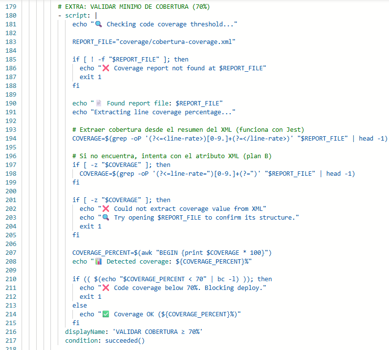

**Funciona con éxito:**

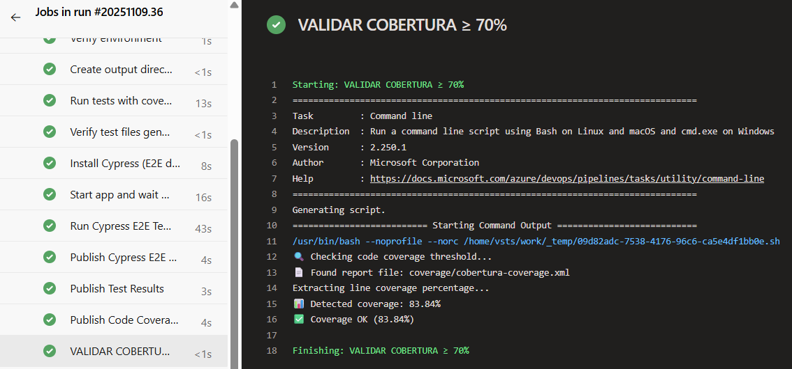