# decisiones.md - TP08 Automatización y Contenedores en la nube - Ing de Software 3

## App utilizada para el TP
Para este TP usaremos una aplicación web full-stack construida con Node.js y Express, usando una base de datos SQLite. 
La aplicación llamada **TikTask** es un gestor de tareas donde se le permite a los usuarios registrarse, iniciar sesión, crear y gestionar tareas personales, hacer búsquedas filtradas de las mismas y ver estadísticas sobre su avance. El usuario administrador además puede gestionar usuarios y ver las tareas de todos.

## Reestructuración del proyecto
Antes de empezar a desarrollar el TP y con el objetivo de cumplir con las consignas del trabajo práctico y aplicar buenas prácticas de arquitectura basadas en contenedores, se reorganizó el proyecto separando la aplicación en dos módulos independientes:
- `backend/`: Servicios API (Node.js + Express + SQLite).
- `frontend/`: Interfaz web estática (HTML/CSS/JS) servida luego por Nginx.


Esta reestructuración sigue el enfoque recomendado para aplicaciones contenedorizadas donde cada servicio debe tener su propio entorno de ejecución y su propio Dockerfile.

## Herramientas/plataformas utilizadas y por qué

# Desarrollo del TP

## 1. Preparación del proyecto

### 1.1. Crear archivos `Dockerfile`
Creamos los siguientes archivos:
- `backend/Dockerfile`: Imagen de la API Node/Express.
- `frontend/Dockerfile`: Imagen del frontend servido por Nginx.
- `frontend/nginx.conf`: Configuración de Nginx para servir la UI.
- `.dockerignore` en ambos módulos para reducir el tamaño de imágenes y evitar archivos innecesarios.
- `docker-compose.yml` en la raíz para ejecutar ambos servicios localmente y validar la arquitectura.

Creamos los dockerfiles para la creación de imágenes docker.

## 2. Configuración de Container Registry
Para esta parte decidimos usar **GitHub Container Registry (GHCR)** y vamos a configurar todo desde la terminal.

**Justificación**: 
- **Integración nativa con GitHub**: El repositorio del proyecto ya está en GitHub, lo que facilita la configuración de GitHub Actions para CI/CD.
- **Coste cero**: Almacenamiento ilimitado para imágenes públicas y generoso para privadas dentro del plan gratuito.
- **Control de visibilidad**: Permite cambiar entre público/privado según el ambiente (QA público, PROD privado si es necesario).
- **Autenticación simple**: PAT (Personal Access Token) con scopes granulares.
- **Compatibilidad con servicios cloud**: Render, Railway, Fly.io y otros servicios gratuitos soportan pull desde GHCR público.
- **Versionado por tags**: Naming estándar `ghcr.io/<owner>/<image>:<tag>` (ej: `latest`, `qa-1`, `prod-1`, commit SHA).

**Alternativas consideradas y por qué no las elegimos:**
| Registry | Ventaja | Desventaja para este TP |
|----------|---------|-------------------------|
| Docker Hub | Más conocido | Solo 1 repo privado gratis, rate limits agresivos |
| Azure ACR | Integración con Azure | Costo (~$5/mes mínimo), overkill para este proyecto |
| GitLab CR | Similar a GHCR | Repositorio ya está en GitHub, duplicaría trabajo |
| AWS ECR | Robusto | Requiere cuenta AWS, configuración más compleja |

**Conclusión**: GHCR es la opción óptima para este TP por costo cero, simplicidad y compatibilidad con nuestro stack.

### 2.1. Login en GHCR
1. Creo un Personal Access Token con permisos:
- `write:packages` - Para subir imágenes
- `read:packages` - Para descargar imágenes
- `delete:packages` - Para eliminar versiones antiguas (housekeeping)
- `workflow` - Para integración con GitHub Actions (próximo paso)


2. Me logueo en GHCR:
En la terminal corro lo siguiente:
```bash
export CR_PAT=mi_token
echo $CR_PAT | docker login ghcr.io -u belutreachi --password-stdin
```

Lo que hice fue guardar el token que creé en una variable de entorno temporal y loguearme con mi usuario de GitHub.

### 2.2. Build y tag del backend
Desde la raíz del repo corro lo siguiente en la terminal:
```bash
# Habilitar builder multi-arquitectura (lo hago 1 sola vez)
docker buildx create --use

# Build para linux/amd64 (Render/GHCR) y tag
docker buildx build \
  --platform linux/amd64 \
  -f backend/Dockerfile \
  -t ghcr.io/belutreachi/tiktask-api:latest \
  --load \
  ./backend

# (Opcional) otro tag, por ejemplo el commit corto
GIT_SHA=$(git rev-parse --short HEAD)
docker tag ghcr.io/belutreachi/tiktask-api:latest ghcr.io/belutreachi/tiktask-api:$GIT_SHA
```


Hago push para subir la imagen a GHCR:
```bash
docker push ghcr.io/belutreachi/tiktask-api:latest
docker push ghcr.io/belutreachi/tiktask-api:$GIT_SHA
```


### 2.3. Build y tag del frontend
Desde la raíz del repo corro lo siguiente en la terminal:
```bash
docker buildx build \
  --platform linux/amd64 \
  -f frontend/Dockerfile \
  -t ghcr.io/belutreachi/tiktask-web:latest \
  --load \
  ./frontend

# (Opcional) tag por commit
docker tag ghcr.io/belutreachi/tiktask-web:latest ghcr.io/belutreachi/tiktask-web:$GIT_SHA
```


Hago push para subir la imagen a GHCR:
```bash
docker push ghcr.io/belutreachi/tiktask-web:latest
docker push ghcr.io/belutreachi/tiktask-web:$GIT_SHA
```


### 2.4. Verificación rápida en GHCR
Verificamos que se hayan creado correctamente las imagenes en GitHub Packages:

Les cambio la visibilidad a pública para evitar problemas con render:


### 2.5. Probar ejecución local tirando desde GHCR (sin mi contexto)
Para simular un "entorno limpio" y verificar que las imágenes funcionan correctamente desde el registry, creé un archivo `docker-compose.yml` en la raíz del proyecto que utiliza directamente las imágenes subidas a GHCR.

## 3. Deploy en Ambiente QA
Para este paso decidimos usar **Render.com**.

**Justificación**:
- **Costo cero**: Plan gratuito suficiente para QA/Prod.
- **Deploy automático desde container registry**: Soporta GHCR público sin autenticación.
- **URLs públicas automáticas**: Acceso inmediato sin configuración de DNS.
- **Disco persistente gratis**: 1GB suficiente para SQLite en QA y Prod.
- **Zero-downtime deploys**: Actualizaciones sin caída.
- **Logs integrados**: Debugging fácil desde dashboard.
- **Auto-sleep**: Instancias free duermen después de 15min de inactividad (apropiado para QA y Prod).

**Alternativas consideradas:**

| Servicio | Ventaja | Por qué no se usó |
|----------|---------|-------------------|
| Fly.io | Más control de infraestructura | Configuración más compleja |
| Railway.app | $5 crédito mensual | Render tiene mejor free tier |
| Heroku | Muy conocido | Ya no tiene plan gratuito |
| Azure ACI | Integración con Azure | Costo desde el primer minuto |

### 3.1. Crear cuenta en Render
Fui a https://render.com y me registré usando mi cuenta de GitHub. 

### 3.2. Deploy del Backend
Crear **Web Service** para el Backend:

En el board de services de Render voy a **Web Services** → **New Web Service**:

Elijo **Existing image** y completo con la **URL de la imagen**. Luego hago click en Connect:

Luego completo los campos de **configuración básica** con lo siguiente:


Después agrego **Environment variables**:
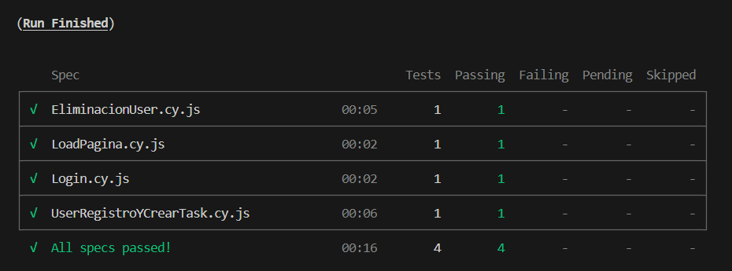
Por último completo las **configuraciones avanzadas** con el path para **health checks**:


No pudimos configurar recursos como CPU y memoria ya que esas configuraciones no están disponibles para el plan gratuito de Render.

**¿Por qué esta configuración para QA?**

| Parámetro | Valor | Justificación |
|-----------|-------|---------------|
| **Servicio** | Render Web Service (Free) | Gratuito, suficiente para testing funcional |
| **Imagen Docker** | `ghcr.io/belutreachi/tiktask-api:latest` | Última versión stable del backend |
| **NODE_ENV** | `development` | Permite logs verbosos y stack traces completos para debugging |
| **DATABASE_PATH** | `/app/data/database.sqlite` | Path con permisos correctos (usuario `node`) |
| **JWT_SECRET** | `render-qa-secret-key-2024-change-in-prod` | Secret único para QA, diferente de PROD |
| **Disco persistente** | ❌ No disponible (limitación plan Free) | Datos se resetean con cada restart - aceptable para QA |
| **Health Check Path** | `/api/health` | Endpoint simple que verifica conectividad a BD |
| **Health Check Interval** | 30 segundos | Intervalo relajado, QA tolera downtime mayor |
| **Auto-Deploy** | ✅ Activado | Continuous deployment: cada push a `main` actualiza QA |
| **Auto-Sleep** | ✅ Después de 15 min inactividad | Cold start de ~30s - aceptable para ambiente de testing |

Hago el Deploy y corre correctamente. A la URL del servicio (`https://tiktask-api-qa.onrender.com`) le agrego `/api/health` al final para ver que el backend responde:


### 3.3. Deploy del Frontend
1. Primero debo actualizar el archivo `nginx.conf`:

Cambio: 
```bash
proxy_pass http://backend:3000;
```

Por:
```bash
proxy_pass https://tiktask-api-qa.onrender.com;
```

Hago rebuild y push de la imagen del frontend:
```bash
# Build con la nueva configuración
docker buildx build \
  --platform linux/amd64 \
  -f frontend/Dockerfile \
  -t ghcr.io/belutreachi/tiktask-web:latest \
  --load \
  ./frontend

# Push
docker push ghcr.io/belutreachi/tiktask-web:latest
```

2. Crear el Web Service para el Frontend:

Completo con la **URL de la imagen** y hago click en Connect:

Completo la **configuración básica**:


No agrego Environment Variables porque ya está todo hardcodeado en el archivo `nginx.conf`.
Nuevamente debido al plan gratuito tampoco puedo configurar recursos.

Hago el Deploy:

Abro la URL de render y aparece correctamente la página:


Pruebo algunas funcionalidades y todo funciona correctamente:


Además, también creé un **environment de QA** para que los servicios de QA estén en ese ambiente, separados de los de PROD que hice después:
 

## 4. Deploy en Ambiente PROD
Para esta parte decidimos seguir trabajando con **Render.com** por los siguientes motivos:
- **Madurez del stack**: ya validamos que Render funciona perfectamente con nuestros contenedores GHCR.
- **Separación lógica mediante environments**: Render tiene feature nativo de environments que separa completamente QA de PROD.
- **Continuous deployment simplificado**: mismo workflow de CI/CD, solo cambiando tags (qa-latest vs prod-latest).
- **Monitoreo unificado**: dashboard único para ambos ambientes.

### 4.1. Deploy del Backend

**Imágenes Docker:**
- Ambos ambientes usan: `ghcr.io/belutreachi/tiktask-api:latest`
- Estrategia: "Build once, deploy anywhere" - misma imagen, diferente configuración

| Configuración | QA (`tiktask-api-qa`) | PROD (`tiktask-api-prod`) | Justificación |
|--------------|----------------------|---------------------------|---------------|
| **Environment** | `qa` | `production` | Segregación lógica en Render |
| **NODE_ENV** | `development` | `production` | Node.js activa optimizaciones en prod (minificación, caching) |
| **PORT** | `10000` | `10000` | Puerto estándar de Render (requerido) |
| **DATABASE_PATH** | `/app/data/database.sqlite` | `/app/data/database.sqlite` | Mismo path, discos físicamente separados por servicio |
| **LOG_LEVEL** | `debug` | `error` | QA: logs verbosos para debugging. PROD: solo errores críticos |
| **Health Check Path** | `/api/health` | `/api/health` | Endpoint de health check |
| **Health Check Interval** | 30 segundos | 10 segundos | PROD requiere detección más rápida de fallos |
| **Persistent Disk** | `/app/data` - 1GB | `/app/data` - 1GB | Almacenamiento para SQLite, aislado por servicio |
| **Auto-Deploy** | ✅ Activado | ❌ Desactivado | QA: CI continuo. PROD: deploys controlados manualmente |

Primero creo un nuevo environment en el Dashboard de mi proyecto llamado **PROD**:

Voy a **Create new service** → **Web Services** → **New Web Service**. Elijo **Existing Image** y copio la URL de mi imagen del backend:

Hago click en **Connect** y completo la **configuración básica**:


Configuro **Environment variables** distintas a las de **QA**:
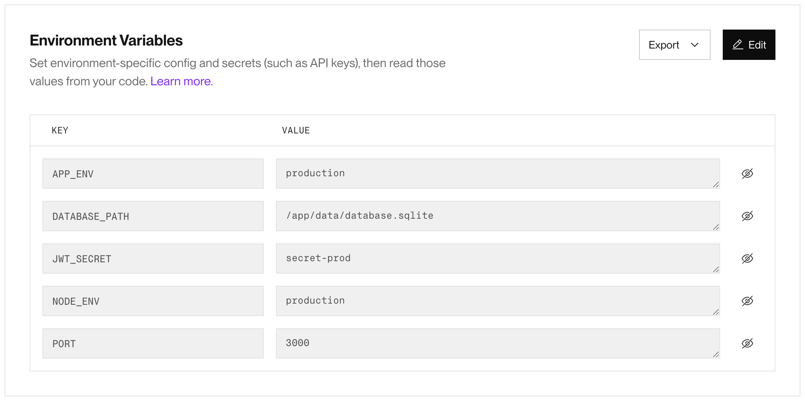
Por último completo las **configuraciones avanzadas** de la siguiente manera:

Hago click en **Deploy Web Service** y noto que corre exitosamente. A la URL del servicio (`https://tiktask-api-prod.onrender.com`) le agrego `/api/health` al final para ver que el backend responde:


Nuevamente no pudimos configurar recursos como CPU y memoria debido a limitaciones del plan gratuito de Render.

**¿Por qué esta configuración para PROD?**

1. **`NODE_ENV=production` vs `development`**: 
   - En PROD activamos las optimizaciones de Node.js (minificación, caching, sin stack traces completos).
   - En QA usamos `development` para tener logs más verbosos y debugging más fácil.

2. **Health Check más frecuente en PROD** (10s vs 30s):
   - PROD requiere detección de fallos más rápida para minimizar downtime.
   - QA tolera checks menos frecuentes ya que el uptime no es crítico.

33. **Auto-Deploy desactivado en PROD**:
   - PROD requiere control manual de deployments (se activa vía pipeline aprobado).
   - QA permite continuous deployment para validaciones rápidas.

4. **Mismo `DATABASE_PATH` pero discos físicamente separados**:
   - Cada servicio en Render tiene su propio disco persistente aislado.
   - Garantiza que datos de QA nunca interfieran con PROD.

5. **`JWT_SECRET` diferentes**:
   - Tokens de QA no son válidos en PROD y viceversa.
   - Mejora la seguridad al segregar sesiones por ambiente.

### 4.2. Deploy del Frontend

**Imágenes Docker:**
- Ambos ambientes usan: `ghcr.io/belutreachi/tiktask-web:latest`
- Nginx configurado con templates para URLs dinámicas del backend

| Configuración | QA (`tiktask-web-qa`) | PROD (`tiktask-web-prod`) | Justificación |
|--------------|----------------------|---------------------------|---------------|
| **Environment** | `qa` | `production` | Segregación lógica en Render |
| **API_URL** | `https://tiktask-api-qa.onrender.com` | `https://tiktask-api-prod.onrender.com` | Nginx usa esta variable para proxy_pass dinámico |
| **PORT** | `80` | `80` | Puerto HTTP estándar |
| **Auto-Deploy** | ✅ Activado | ❌ Desactivado | Consistente con estrategia del backend |

1. Modificar el archivo `nginx.conf`.

Debo cambiar:
```bash
proxy_pass https://tiktask-api-qa.onrender.com;
```

Por:
```bash
proxy_pass ${API_URL};
```

Y borrar esta línea:
```bash
proxy_set_header Host tiktask-api-qa.onrender.com;
```

**Estrategia de configuración dinámica:**
El frontend utiliza Nginx templates (`nginx.conf.template`) con variables de entorno para configurar el backend URL dinámicamente (permite que no se rompa QA si corro en PROD):
```nginx
location /api/ {
    proxy_pass ${API_URL};
    # Nginx reemplaza ${API_URL} con la variable de entorno al iniciar
}
```

Hago rebuild y push de la imagen del frontend:
```bash
docker buildx build \
  --platform linux/amd64 \
  -f frontend/Dockerfile \
  -t ghcr.io/belutreachi/tiktask-web:latest \
  --load \
  ./frontend

docker push ghcr.io/belutreachi/tiktask-web:latest
```

2. Crear el Web Service para el Frontend
Voy a mi **Environment PROD** y hago click en **New Service** → **Web Service**:

Elijo **Existing Image** y pego la URL de mi imagen del frontend:

Hago click en **Connect** y completo la **configuración básica**:


Configuro las siguientes **variables de entorno**:
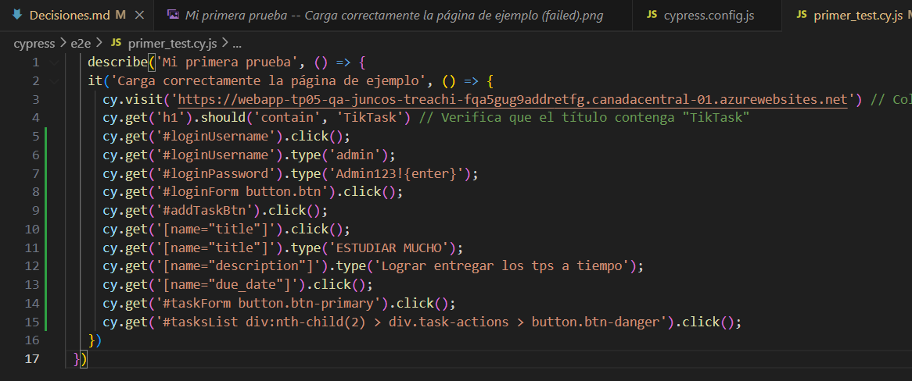

Hago click en **Deploy Web Service** y noto que corre exitosamente.:


Pruebo algunas funcionalidades y todo funciona bien:


### 4.3. Implementar continuous deployment desde mi registry
En mi Web Service `tiktask-web-prod` voy a **Settings** → **Deploy** y copio el Deploy Hook. Hago lo mismo para el Web Service `tiktask-api-prod`. Con estos hooks vamos a automatizar los despliegues dentro del pipeline que creamos en el siguiente paso.

### 4.4. Diferencias de configuración entre QA y PROD

#### Tabla comparativa completa:

| Aspecto | QA | PROD | Justificación |
|---------|-----|------|---------------|
| **Servicio usado** | Render Web Service | Render Web Service | Mismo servicio, diferentes instancias |
| **Imagen Docker** | `ghcr.io/belutreachi/tiktask-api:latest` | `ghcr.io/belutreachi/tiktask-api:latest` | Build once, deploy anywhere |
| **Environment Render** | `qa` | `production` | Segregación lógica en dashboard |
| **NODE_ENV** | `development` | `production` | Optimizaciones de Node.js solo en PROD |
| **DATABASE_PATH** | `/app/data/database.sqlite` | `/app/data/database.sqlite` | Mismo path, discos físicamente aislados |
| **JWT_SECRET** | `render-qa-secret-key-2024` | `render-prod-secret-key-2024` | Secrets diferentes previenen reutilización de tokens |
| **Health Check Interval** | 30 segundos | 10 segundos | PROD necesita detección de fallos más rápida |
| **Health Check Path** | `/api/health` | `/api/health` | Mismo endpoint, funcionalidad idéntica |
| **Auto-Deploy** | ✅ Activado | ❌ Desactivado | QA: CI continuo. PROD: control manual vía pipeline |
| **Escalabilidad** | Sin auto-scaling (plan Free) | Sin auto-scaling (plan Free) | Limitación del plan gratuito |
| **Monitoreo/Logs** | Render Dashboard | Render Dashboard | Logs centralizados por servicio |
| **Costo estimado** | $0/mes | $0/mes | Ambos en plan Free de Render |

#### Segregación de ambientes:

**Backend:**
- QA: `https://tiktask-api-qa.onrender.com`
- PROD: `https://tiktask-api-prod.onrender.com`

**Frontend:**
- QA: `https://tiktask-web-qa.onrender.com`
- PROD: `https://tiktask-web-prod.onrender.com`

**Ventajas de usar el mismo servicio:**
- **Paridad QA-PROD**: El comportamiento en QA predice con precisión el de PROD
- **Configuración portable**: Mismos Dockerfiles, mismo flujo de deployment
- **Troubleshooting simplificado**: Logs y métricas en la misma interfaz
- **Costo cero**: Plan Free suficiente para ambos ambientes

**Desventajas/Limitaciones identificadas:**
- **Sin auto-scaling**: Plan Free no soporta escalado automático
- **Auto-sleep después de 15min**: Cold start de ~30s en primer request (aceptable para este TP)
- **Límites de recursos**: 512 MB RAM, 0.1 vCPU compartido
- **Sin disco persistente en plan Free**: Usamos `/app/data` en memoria (datos se resetean con cada reinicio)

## 5. Pipeline CI/CD Completo
Para este paso decidimos usar **GitHub Actions**.

**Justificación**:
1. **Integración nativa con el repositorio**:
   - El código y el pipeline CI/CD viven en el mismo repositorio
   - No requiere configuración externa ni webhooks manuales
   - Versionado del pipeline junto con el código (`.github/workflows/`)

2. **Integración perfecta con GHCR**:
   - Autenticación automática con `secrets.GITHUB_TOKEN`
   - No requiere crear credentials adicionales
   - Push de imágenes Docker sin configuración extra

3. **Costo cero para este proyecto**:
   - 2000 minutos/mes gratis para repositorios privados
   - Minutos ilimitados para repositorios públicos
   - Suficiente para múltiples builds diarios

4. **Sintaxis declarativa simple (YAML)**:
   - Fácil de leer y mantener
   - Reutilización de actions del marketplace
   - Menos código boilerplate que otras herramientas

5. **Environments nativos**:
   - Soporte built-in para QA y PROD
   - Required reviewers para aprobaciones manuales
   - Variables y secrets por ambiente
   - URLs de deployment automáticas

6. **Debugging integrado**:
   - Logs en tiempo real por step
   - Re-run de jobs fallidos
   - Artifacts para descargar outputs

### Comparación con alternativas:

| Herramienta | Ventajas | Por qué no la elegimos |
|-------------|----------|------------------------|
| **Azure DevOps** | Poderoso, pipelines complejos | Overkill para este proyecto, curva de aprendizaje más pronunciada |
| **GitLab CI/CD** | Excelente, runner propio | Repositorio ya está en GitHub, duplicaría esfuerzo |
| **Jenkins** | Muy flexible, self-hosted | Requiere mantener servidor, configuración compleja |
| **CircleCI** | Buen free tier (6000 min/mes) | GitHub Actions tiene mejor integración con GHCR |
| **Travis CI** | Simple para open source | Menos features que GitHub Actions, menor comunidad |

### Arquitectura del pipeline implementado:
```
┌─────────────────────────────────────────────────────────────┐
│  TRIGGER: Push to main/master                               │
└────────────────┬────────────────────────────────────────────┘
                 │
                 ▼
┌─────────────────────────────────────────────────────────────┐
│  JOB 1: Build & Test                                        │
│  • Checkout code                                            │
│  • Setup Node.js 18                                         │
│  • Install dependencies (backend)                           │
│  • Run tests (backend)                                      │
└────────────────┬────────────────────────────────────────────┘
                 │ ✅ Tests pass
                 ▼
┌─────────────────────────────────────────────────────────────┐
│  JOB 2: Build & Push Docker Images                          │
│  • Login to GHCR (auto con GITHUB_TOKEN)                    │
│  • Build backend image (multi-platform)                     │
│  • Push backend to ghcr.io/belutreachi/tiktask-backend      │
│  • Build frontend image (multi-platform)                    │
│  • Push frontend to ghcr.io/belutreachi/tiktask-frontend    │
│  • Tags: latest, commit SHA, run number                     │
└────────────────┬────────────────────────────────────────────┘
                 │ ✅ Images pushed
                 ▼
┌─────────────────────────────────────────────────────────────┐
│  JOB 3: Deploy to QA (Render)                               │
│  Environment: QA                                            │
│  • Trigger Render Deploy Hook (backend QA)                  │
│  • Trigger Render Deploy Hook (frontend QA)                 │
│  • Wait 60s for deployment                                  │
│  • Verify backend health (GET /api/health)                  │
│  • Verify frontend health (GET /)                           │
└────────────────┬────────────────────────────────────────────┘
                 │ ✅ QA healthy
                 ▼
┌─────────────────────────────────────────────────────────────┐
│  JOB 4: Deploy to Production (Render)                       │
│  Environment: Production (requires approval)                │
│  ⏸️  PAUSA → Espera aprobación manual del reviewer          │
│  ✅ Aprobado por: belutreachi                               │
│  • Trigger Render Deploy Hook (backend PROD)                │
│  • Trigger Render Deploy Hook (frontend PROD)               │
│  • Wait 90s for deployment                                  │
│  • Verify backend health                                    │
│  • Verify frontend health                                   │
│  • Notify success con URLs de ambos ambientes               │
└─────────────────────────────────────────────────────────────┘
```

### Estrategia de deployment implementada:

**Build once, deploy everywhere:**
- Las imágenes Docker se construyen **una sola vez** en el job 2.
- Mismas imágenes se despliegan en QA y PROD.
- Diferenciación por variables de entorno únicamente.
- Garantiza paridad entre ambientes.

**Quality gates:**
- Tests automáticos antes de build.
- Health checks después de cada deployment.
- Aprobación manual antes de PROD.
- Rollback posible desde Render dashboard.

### 5.1. Crear archivo del pipeline
Primero creo una carpeta llamada `.github/workflows` y adentro creo el archivo `cicd-pipeline.yml`.

### 5.2. Configurar Environments en GitHub
En mi repo de GitHub voy a **Settings** → **Environments** → click en **New environment**.

Para **QA** completo con:
- Name: **QA**
- **NO** agrego **required viewers** (deploy automático)
Hago click en **Save protection rules**.

Para **PROD** completo con:
- Name: **PROD**
- Agrego **required viewers** para la aprobación manual. Agrego mi usuario.
Hago click en **Save protection rules**.

Los dos ambientes creados exitosamente:
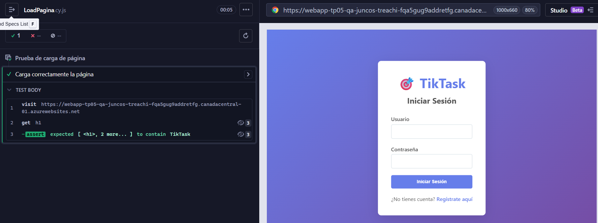

### 5.3. Configurar Secrets en GitHub
En mi repo voy a **Settings** → **Environments** → ***Environment correspondiente*** → **Environment secrets** → **Add environment secret** y creo los siguientes secretos completando sus valores con los Deploy Hooks correspondientes:
```bash
RENDER_BACKEND_QA_DEPLOY_HOOK
RENDER_FRONTEND_QA_DEPLOY_HOOK
RENDER_BACKEND_PROD_DEPLOY_HOOK
RENDER_FRONTEND_PROD_DEPLOY_HOOK
```
**QA**:
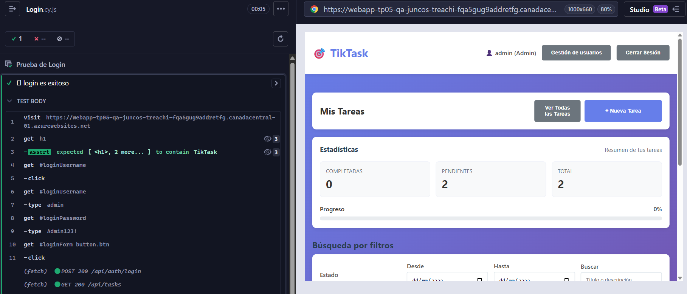
**PROD**:
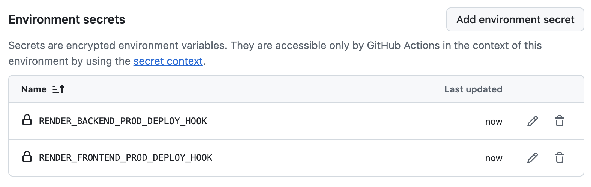

### 5.4. Configurar Variables en GitHub
En mi repo voy a **Settings** → **Environments** → ***Environment correspondiente*** → **Environment variables** → **Add environment variable** y creo las siguientes variables con sus valores correspondientes:
```bash
QA_BACKEND_URL = https://tiktask-api-qa.onrender.com
QA_FRONTEND_URL = https://tiktask-web-qa.onrender.com
PROD_BACKEND_URL = https://tiktask-api-prod.onrender.com
PROD_FRONTEND_URL = https://tiktask-web-prod.onrender.com
```
**QA**:
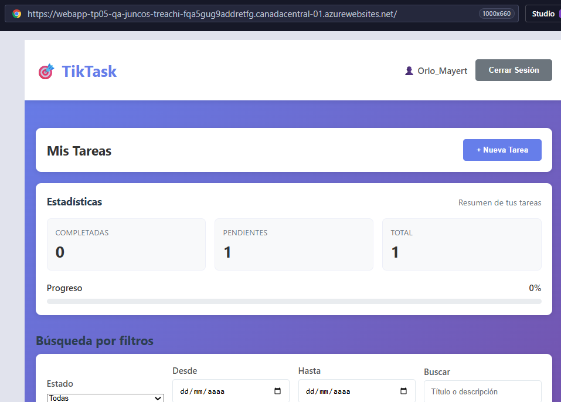
**PROD**:
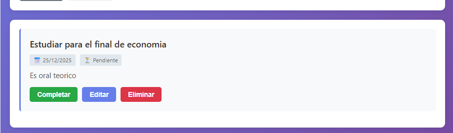

Luego pusheo todo, espero a que corran los jobs y corroboro que el pipeline haya corrido con éxito:

Me pide **aprobación manual para PROD**:
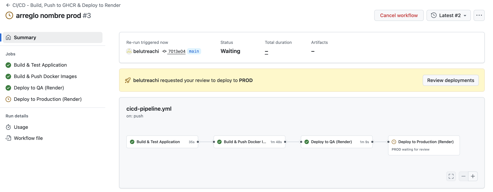
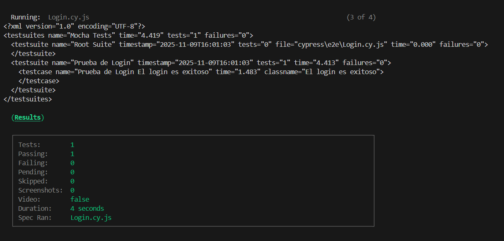

Podemos notar que el **pipeline se ejcutó correctamente** y **ambos ambientes funcionan**:
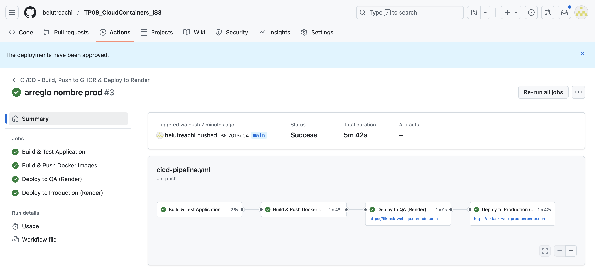
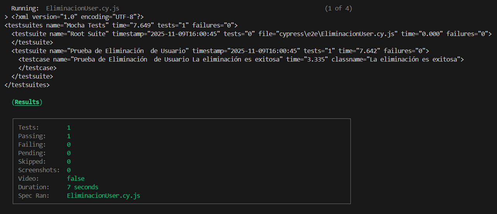
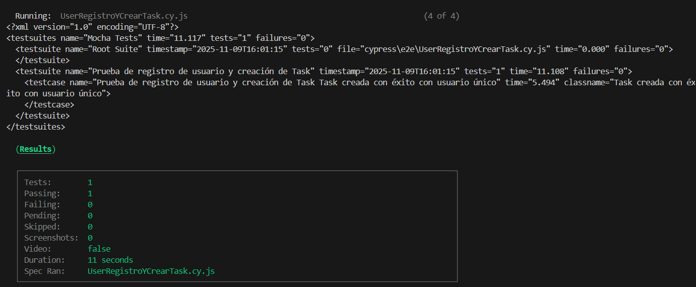

## 6. Análisis Comparativo QA vs. PROD

| Aspecto | QA | PROD | Justificación |
|---------|-----|------|---------------|
| **Servicio usado** | Render Web Service (Free) | Render Web Service (Free) | Mismo servicio garantiza paridad de comportamiento. Simplifica mantenimiento y troubleshooting. |
| **CPU/Memoria** | 0.1 vCPU compartido / 512 MB RAM | 0.1 vCPU compartido / 512 MB RAM | Plan Free: recursos idénticos. Suficiente para validación funcional y demos. En producción real se escalaría según carga. |
| **Número de instancias** | 1 instancia | 1 instancia | Plan Free limita a 1 instancia. Para HA en PROD real se necesitarían múltiples instancias (requiere plan pago). |
| **Escalabilidad** | Sin auto-scaling | Sin auto-scaling | Plan Free no soporta auto-scaling. Escala manual vía upgrade de plan. |
| **Costos** | $0/mes | $0/mes | Ambos en plan gratuito de Render. Para producción real: Starter ($7/mes) o Standard ($25/mes). |
| **Monitoreo/Logs** | Render Dashboard (logs básicos) | Render Dashboard (logs básicos) | Logs centralizados por servicio. Retention de 7 días en plan Free. Para PROD real se integraría Datadog/Sentry. |
| **Disco persistente** | ❌ No disponible (plan Free) | ❌ No disponible (plan Free) | Datos se pierden con cada restart. Solución: migrar a PostgreSQL o plan Starter. |
| **Auto-sleep** | ✅ Después de 15 min inactividad | ✅ Después de 15 min inactividad | Cold start ~30s. Aceptable para QA/demos, no para PROD real. |
| **Uptime SLA** | Sin garantía (Best effort) | Sin garantía (Best effort) | Plan Free: sin SLA. Starter: 99% uptime. |
| **Región** | Oregon (US West) | Oregon (US West) | Misma región reduce latencia entre backend y frontend. |
| **Health checks** | Intervalo 30s | Intervalo 10s | PROD necesita detección de fallos más rápida para minimizar downtime. |
| **Deploy strategy** | Auto-deploy al push | Manual via GitHub Actions approval | QA: CI continuo. PROD: control estricto con aprobaciones. |
| **Variables de entorno** | `NODE_ENV=development`, `LOG_LEVEL=debug` | `NODE_ENV=production`, `LOG_LEVEL=error` | QA: logs verbosos para debugging. PROD: optimizado y solo errores críticos. |
| **Secrets** | `JWT_SECRET` único para QA | `JWT_SECRET` único para PROD | Tokens de sesión no intercambiables entre ambientes. |
| **URLs** | `tiktask-api-qa.onrender.com` / `tiktask-web-qa.onrender.com` | `tiktask-api-prod.onrender.com` / `tiktask-web-prod.onrender.com` | Segregación completa por subdominio. |