# decisiones.md - TP08 Automatización y Contenedores en la nube - Ing de Software 3

## App utilizada para el TP
Para este TP usaremos una aplicación web full-stack construida con Node.js y Express, usando una base de datos SQLite. 
La aplicación llamada **TikTask** es un gestor de tareas donde se le permite a los usuarios registrarse, iniciar sesión, crear y gestionar tareas personales, hacer búsquedas filtradas de las mismas y ver estadísticas sobre su avance. El usuario administrador además puede gestionar usuarios y ver las tareas de todos.

## Reestructuración del proyecto
Antes de empezar a desarrollar el TP y con el objetivo de cumplir con las consignas del trabajo práctico y aplicar buenas prácticas de arquitectura basadas en contenedores, se reorganizó el proyecto separando la aplicación en dos módulos independientes:
- `backend/`: Servicios API (Node.js + Express + SQLite).
- `frontend/`: Interfaz web estática (HTML/CSS/JS) servida luego por Nginx.


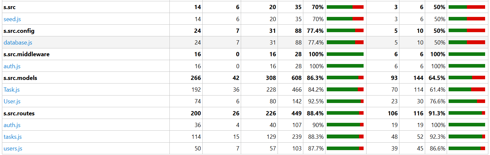

Esta reestructuración sigue el enfoque recomendado para aplicaciones contenedorizadas donde cada servicio debe tener su propio entorno de ejecución y su propio Dockerfile.

## Herramientas/plataformas utilizadas y por qué

# Desarrollo del TP

## 1. Preparación del proyecto

### 1.1. Crear archivos `Dockerfile`
Creamos los siguientes archivos:
- `backend/Dockerfile`: Imagen de la API Node/Express.
- `frontend/Dockerfile`: Imagen del frontend servido por Nginx.
- `frontend/nginx.conf`: Configuración de Nginx para servir la UI.
- `.dockerignore` en ambos módulos para reducir el tamaño de imágenes y evitar archivos innecesarios.
- `docker-compose.yml` en la raíz para ejecutar ambos servicios localmente y validar la arquitectura.

Creamos los dockerfiles para la creación de imágenes docker.

## 2. Configuración de Container Registry
Para esta parte decidimos usar **GitHub Container Registry (GHCR)** y vamos a configurar todo desde la terminal.

**Justificación**: 
- **Integración nativa con GitHub**: El repositorio del proyecto ya está en GitHub, lo que facilita la configuración de GitHub Actions para CI/CD.
- **Coste cero**: Almacenamiento ilimitado para imágenes públicas y generoso para privadas dentro del plan gratuito.
- **Control de visibilidad**: Permite cambiar entre público/privado según el ambiente (QA público, PROD privado si es necesario).
- **Autenticación simple**: PAT (Personal Access Token) con scopes granulares.
- **Compatibilidad con servicios cloud**: Render, Railway, Fly.io y otros servicios gratuitos soportan pull desde GHCR público.
- **Versionado por tags**: Naming estándar `ghcr.io/<owner>/<image>:<tag>` (ej: `latest`, `qa-1`, `prod-1`, commit SHA).

**Alternativas consideradas y por qué no las elegimos:**
| Registry | Ventaja | Desventaja para este TP |
|----------|---------|-------------------------|
| Docker Hub | Más conocido | Solo 1 repo privado gratis, rate limits agresivos |
| Azure ACR | Integración con Azure | Costo (~$5/mes mínimo), overkill para este proyecto |
| GitLab CR | Similar a GHCR | Repositorio ya está en GitHub, duplicaría trabajo |
| AWS ECR | Robusto | Requiere cuenta AWS, configuración más compleja |

**Conclusión**: GHCR es la opción óptima para este TP por costo cero, simplicidad y compatibilidad con nuestro stack.

### 2.1. Login en GHCR
1. Creo un Personal Access Token con permisos:
- `write:packages` - Para subir imágenes
- `read:packages` - Para descargar imágenes
- `delete:packages` - Para eliminar versiones antiguas (housekeeping)
- `workflow` - Para integración con GitHub Actions (próximo paso)

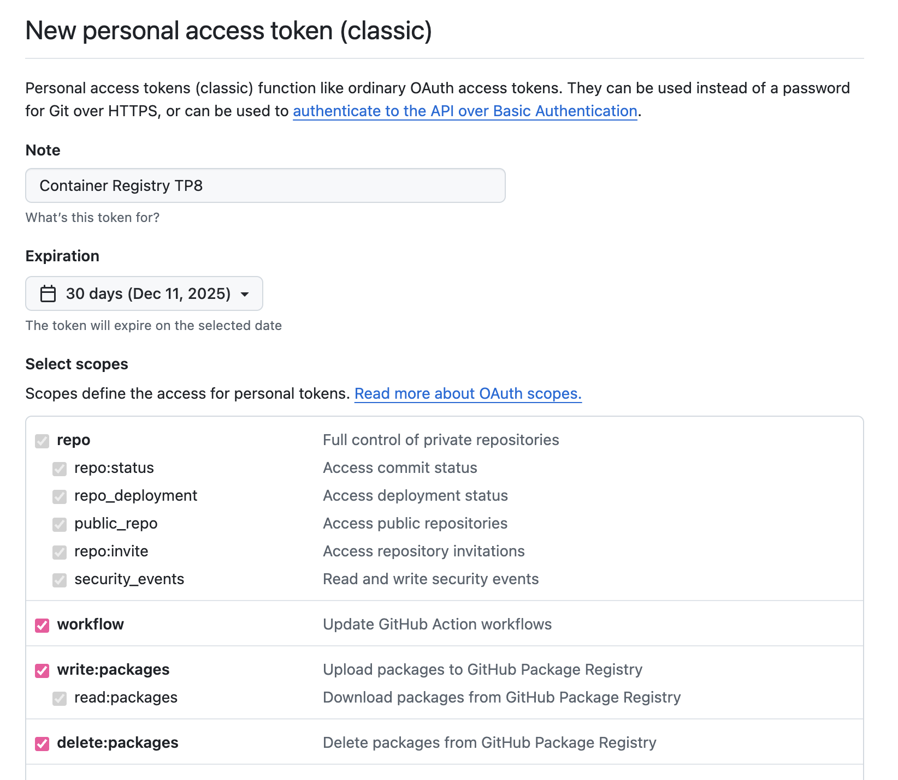
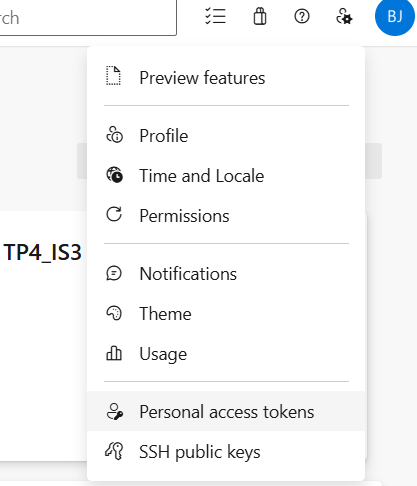

2. Me logueo en GHCR:
En la terminal corro lo siguiente:
```bash
export CR_PAT=mi_token
echo $CR_PAT | docker login ghcr.io -u belutreachi --password-stdin
```
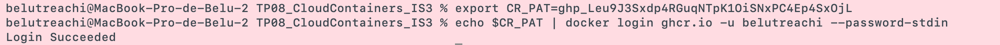
Lo que hice fue guardar el token que creé en una variable de entorno temporal y loguearme con mi usuario de GitHub.

### 2.2. Build y tag del backend
Desde la raíz del repo corro lo siguiente en la terminal:
```bash
# Habilitar builder multi-arquitectura (lo hago 1 sola vez)
docker buildx create --use

# Build para linux/amd64 (Render/GHCR) y tag
docker buildx build \
  --platform linux/amd64 \
  -f backend/Dockerfile \
  -t ghcr.io/belutreachi/tiktask-api:latest \
  --load \
  ./backend

# (Opcional) otro tag, por ejemplo el commit corto
GIT_SHA=$(git rev-parse --short HEAD)
docker tag ghcr.io/belutreachi/tiktask-api:latest ghcr.io/belutreachi/tiktask-api:$GIT_SHA
```
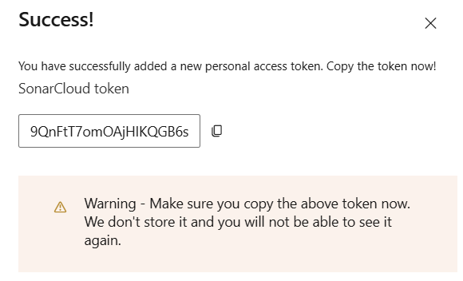

Hago push para subir la imagen a GHCR:
```bash
docker push ghcr.io/belutreachi/tiktask-api:latest
docker push ghcr.io/belutreachi/tiktask-api:$GIT_SHA
```
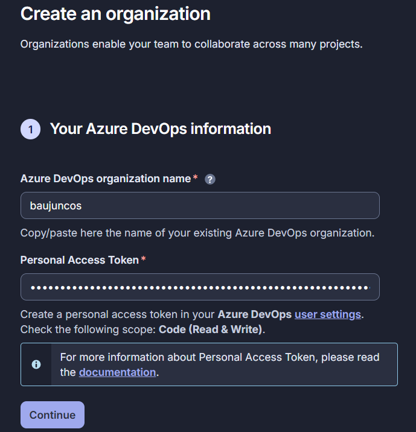

### 2.3. Build y tag del frontend
Desde la raíz del repo corro lo siguiente en la terminal:
```bash
docker buildx build \
  --platform linux/amd64 \
  -f frontend/Dockerfile \
  -t ghcr.io/belutreachi/tiktask-web:latest \
  --load \
  ./frontend

# (Opcional) tag por commit
docker tag ghcr.io/belutreachi/tiktask-web:latest ghcr.io/belutreachi/tiktask-web:$GIT_SHA
```
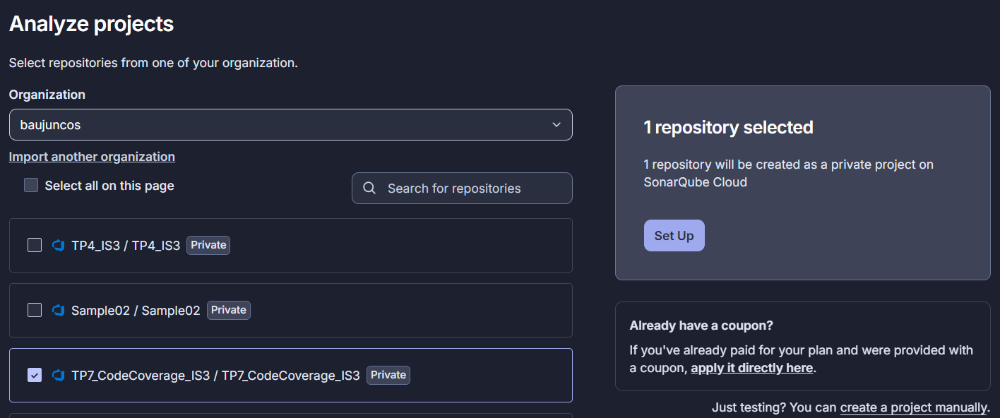

Hago push para subir la imagen a GHCR:
```bash
docker push ghcr.io/belutreachi/tiktask-web:latest
docker push ghcr.io/belutreachi/tiktask-web:$GIT_SHA
```
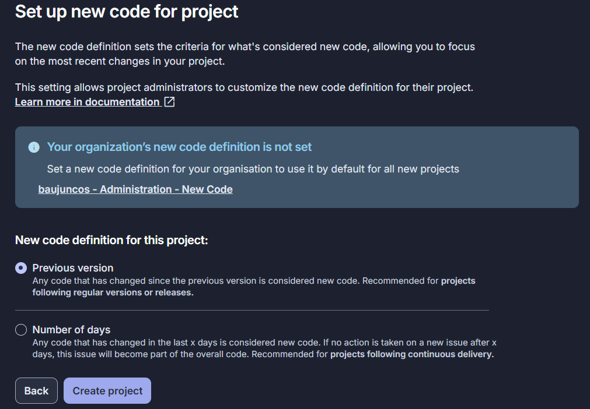

### 2.4. Verificación rápida en GHCR
Verificamos que se hayan creado correctamente las imagenes en GitHub Packages:
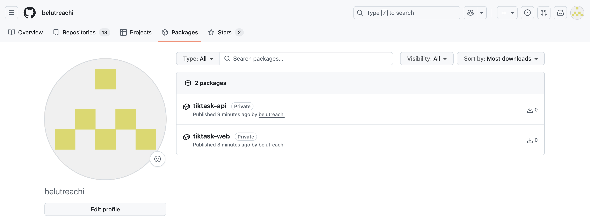
Les cambio la visibilidad a pública para evitar problemas con render:
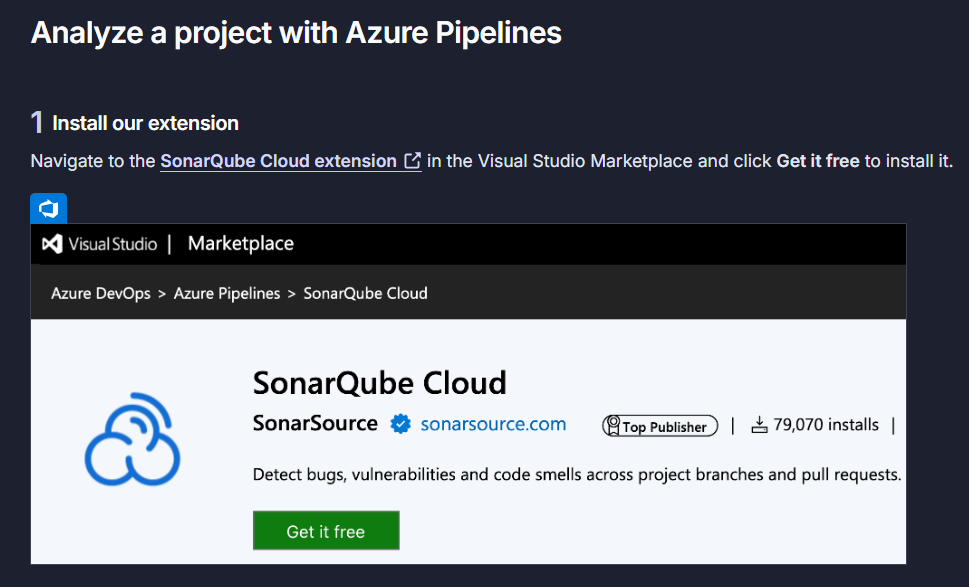

### 2.5. Probar ejecución local tirando desde GHCR (sin mi contexto)
Para simular un "entorno limpio" y verificar que las imágenes funcionan correctamente desde el registry, creé un archivo `docker-compose.yml` en la raíz del proyecto que utiliza directamente las imágenes subidas a GHCR.

## 3. Deploy en Ambiente QA
Para este paso decidimos usar **Render.com**.

**Justificación**:
- **Costo cero**: Plan gratuito suficiente para QA/Prod.
- **Deploy automático desde container registry**: Soporta GHCR público sin autenticación.
- **URLs públicas automáticas**: Acceso inmediato sin configuración de DNS.
- **Disco persistente gratis**: 1GB suficiente para SQLite en QA y Prod.
- **Zero-downtime deploys**: Actualizaciones sin caída.
- **Logs integrados**: Debugging fácil desde dashboard.
- **Auto-sleep**: Instancias free duermen después de 15min de inactividad (apropiado para QA y Prod).

**Alternativas consideradas:**

| Servicio | Ventaja | Por qué no se usó |
|----------|---------|-------------------|
| Fly.io | Más control de infraestructura | Configuración más compleja |
| Railway.app | $5 crédito mensual | Render tiene mejor free tier |
| Heroku | Muy conocido | Ya no tiene plan gratuito |
| Azure ACI | Integración con Azure | Costo desde el primer minuto |

### 3.1. Crear cuenta en Render
Fui a https://render.com y me registré usando mi cuenta de GitHub. 

### 3.2. Deploy del Backend
Crear **Web Service** para el Backend:

En el board de services de Render voy a **Web Services** → **New Web Service**:

Elijo **Existing image** y completo con la **URL de la imagen**. Luego hago click en Connect:

Luego completo los campos de **configuración básica** con lo siguiente:
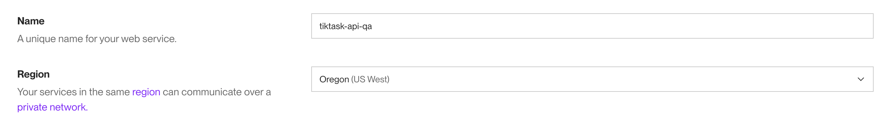
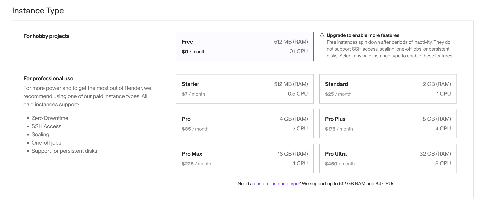
Después agrego **Environment variables**:
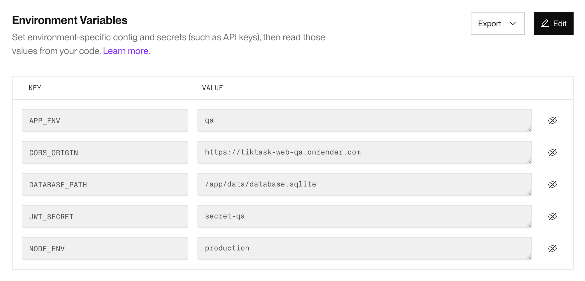
Por último completo las **configuraciones avanzadas** con el path para **health checks**:
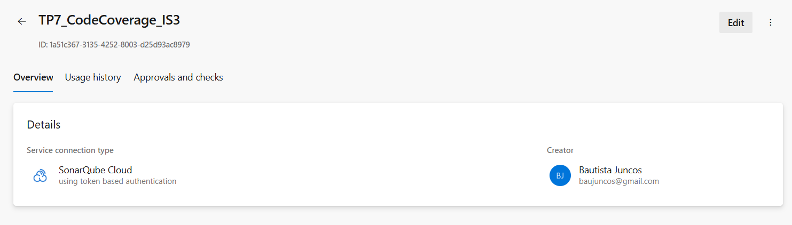

No pudimos configurar recursos como CPU y memoria ya que esas configuraciones no están disponibles para el plan gratuito de Render.

Hago el Deploy y corre correctamente. A la URL del servicio (`https://tiktask-api-qa.onrender.com`) le agrego `/api/health` al final para ver que el backend responde:
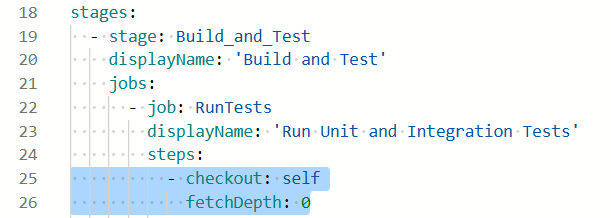
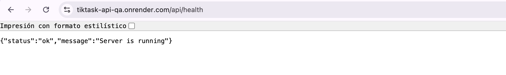

### 3.3. Deploy del Frontend
1. Primero debo actualizar el archivo `nginx.conf`:

Cambio: 
```bash
proxy_pass http://backend:3000;
```

Por:
```bash
proxy_pass https://tiktask-api-qa.onrender.com;
```

Hago rebuild y push de la imagen del frontend:
```bash
# Build con la nueva configuración
docker buildx build \
  --platform linux/amd64 \
  -f frontend/Dockerfile \
  -t ghcr.io/belutreachi/tiktask-web:latest \
  --load \
  ./frontend

# Push
docker push ghcr.io/belutreachi/tiktask-web:latest
```

2. Crear el Web Service para el Frontend:

Completo con la **URL de la imagen** y hago click en Connect:
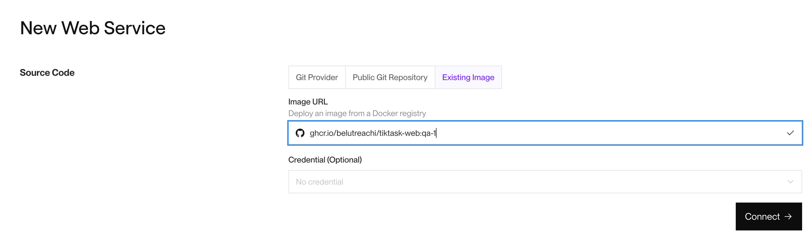
Completo la **configuración básica**:
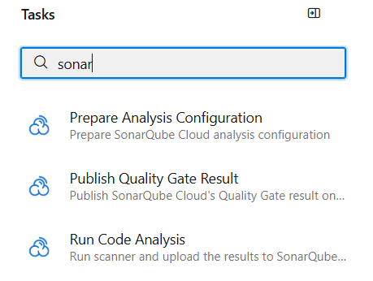
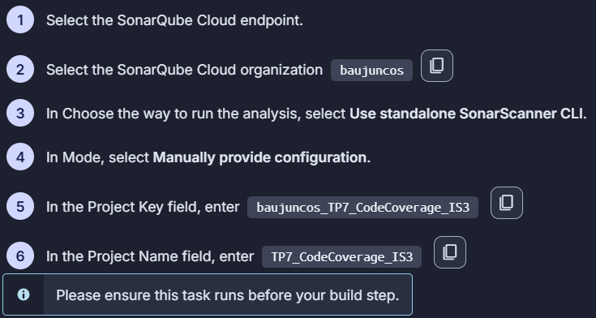

No agrego Environment Variables porque ya está todo hardcodeado en el archivo `nginx.conf`.
Nuevamente debido al plan gratuito tampoco puedo configurar recursos.

Hago el Deploy:
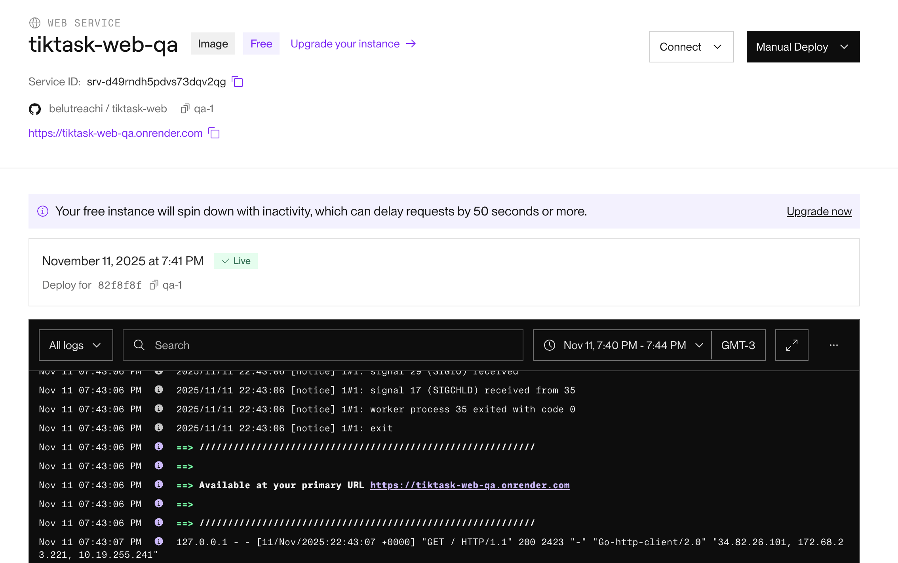
Abro la URL de render y aparece correctamente la página:
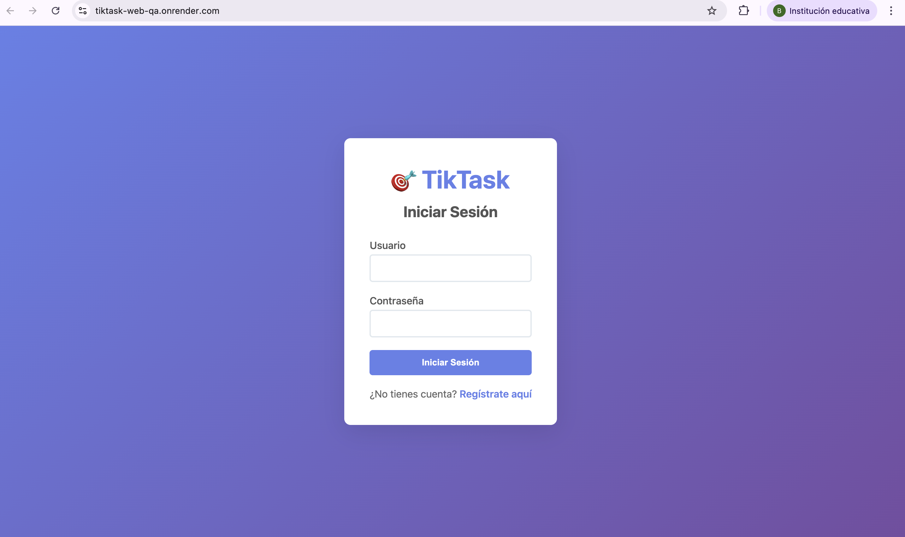
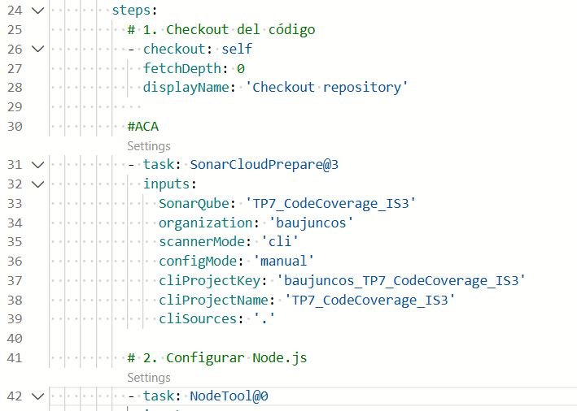
Pruebo algunas funcionalidades y todo funciona correctamente:
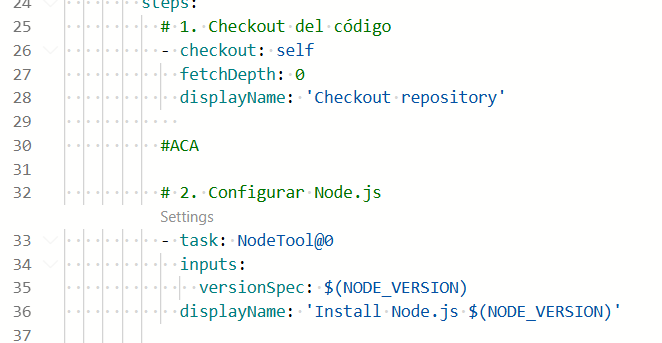
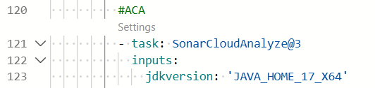
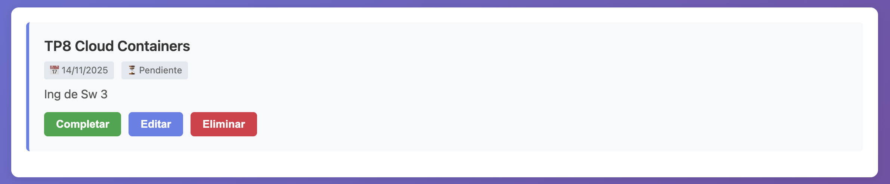

Además, también creé un **environment de QA** para que los servicios de QA estén en ese ambiente, separados de los de PROD que hice después:
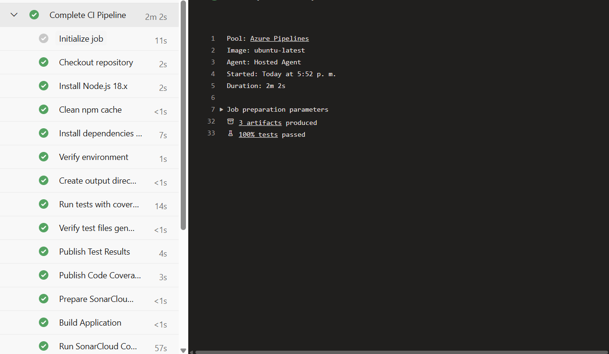 

## 4. Deploy en Ambiente PROD
Para esta parte decidimos seguir trabajando con **Render.com** por los siguientes motivos:
- **Madurez del stack**: ya validamos que Render funciona perfectamente con nuestros contenedores GHCR.
- **Separación lógica mediante environments**: Render tiene feature nativo de environments que separa completamente QA de PROD.
- **Continuous deployment simplificado**: mismo workflow de CI/CD, solo cambiando tags (qa-latest vs prod-latest).
- **Monitoreo unificado**: dashboard único para ambos ambientes.

### 4.1. Deploy del Backend
Primero creo un nuevo environment en el Dashboard de mi proyecto llamado **PROD**:
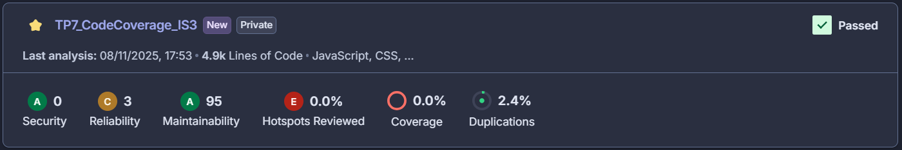
Voy a **Create new service** → **Web Services** → **New Web Service**. Elijo **Existing Image** y copio la URL de mi imagen del backend:
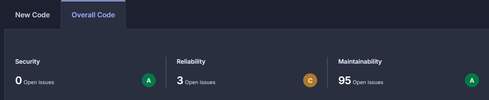
Hago click en **Connect** y completo la **configuración básica**:
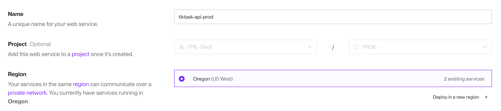
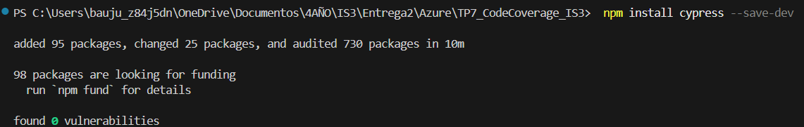
Configuro **Environment variables** distintas a las de **QA**:
Por último completo las **configuraciones avanzadas** de la siguiente manera:
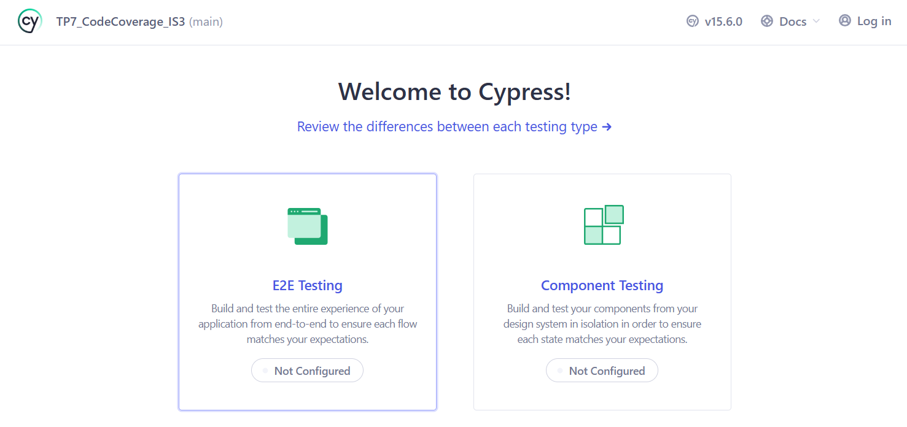
Hago click en **Deploy Web Service** y noto que corre exitosamente. A la URL del servicio (`https://tiktask-api-prod.onrender.com`) le agrego `/api/health` al final para ver que el backend responde:
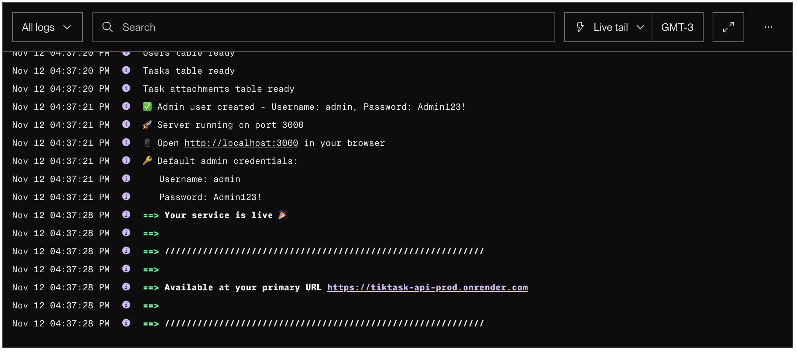
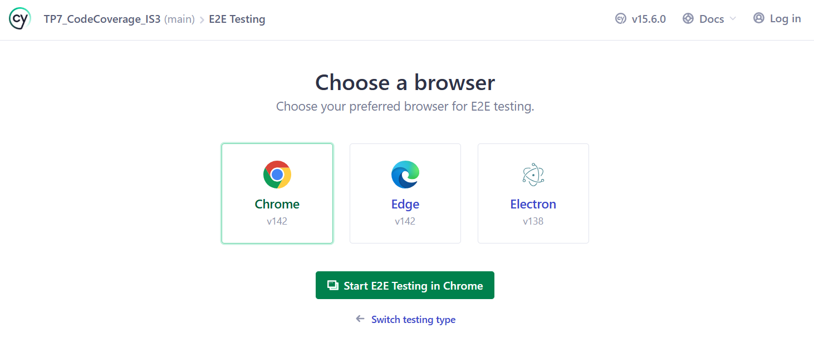

Nuevamente no pudimos configurar recursos como CPU y memoria debido a limitaciones del plan gratuito de Render.

### 4.2. Deploy del Frontend
1. Modificar el archivo `nginx.conf`.

Debo cambiar:
```bash
proxy_pass https://tiktask-api-qa.onrender.com;
```

Por:
```bash
proxy_pass ${API_URL};
```

Y borrar esta línea:
```bash
proxy_set_header Host tiktask-api-qa.onrender.com;
```

Este cambio es necesario para que cuando despleguemos en PROD, no se rompa el despliegie en QA.

Hago rebuild y push de la imagen del frontend:
```bash
docker buildx build \
  --platform linux/amd64 \
  -f frontend/Dockerfile \
  -t ghcr.io/belutreachi/tiktask-web:latest \
  --load \
  ./frontend

docker push ghcr.io/belutreachi/tiktask-web:latest
```

2. Crear el Web Service para el Frontend
Voy a mi **Environment PROD** y hago click en **New Service** → **Web Service**:
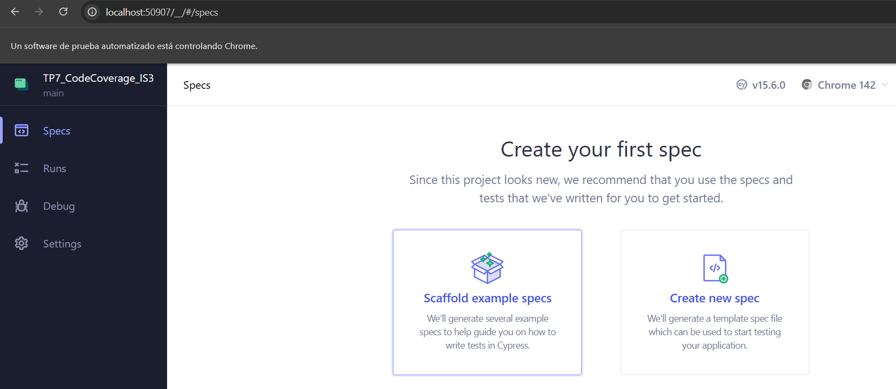
Elijo **Existing Image** y pego la URL de mi imagen del frontend:
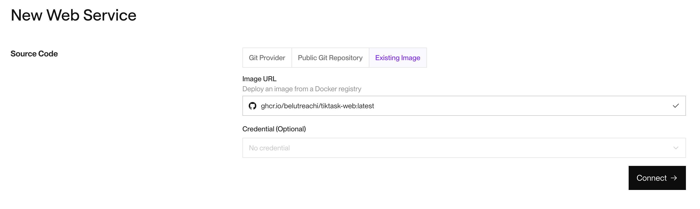
Hago click en **Connect** y completo la **configuración básica**:
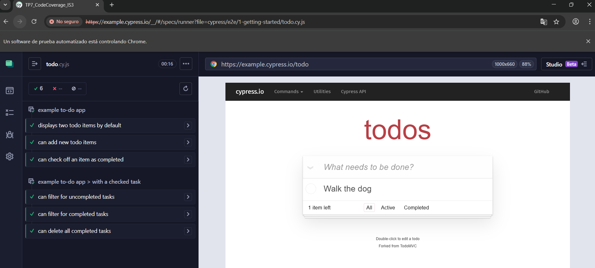
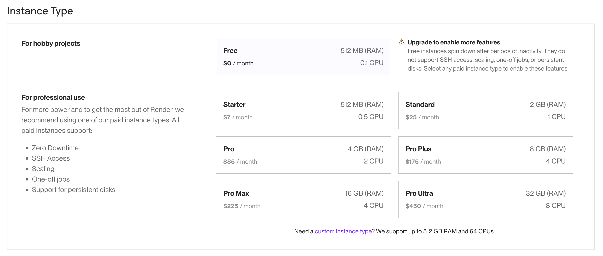
Configuro las siguientes **variables de entorno**:

Hago click en **Deploy Web Service** y noto que corre exitosamente.:
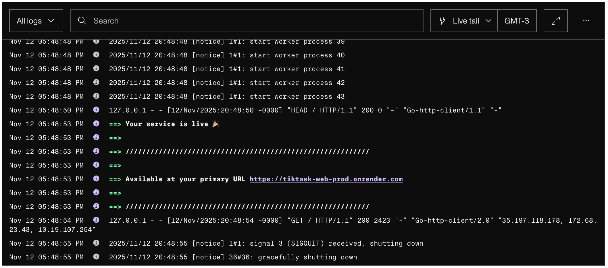
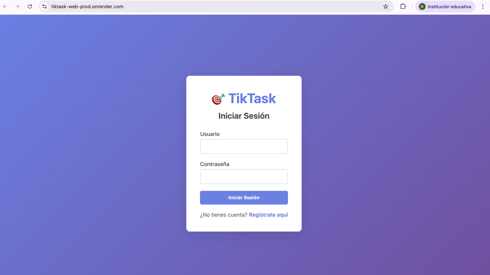
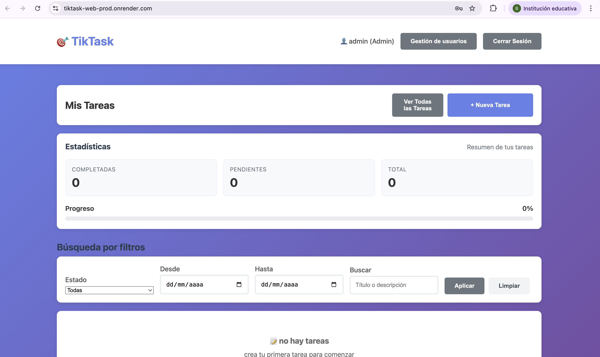
Pruebo algunas funcionalidades y todo funciona bien:
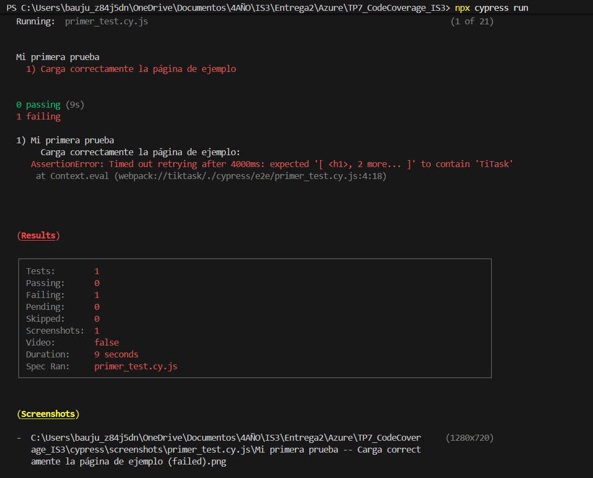
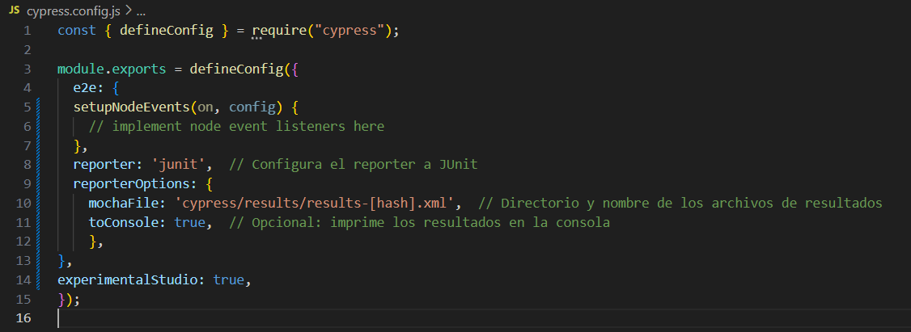

### 4.3. Implementar continuous deployment desde mi registry
En mi Web Service `tiktask-web-prod` voy a **Settings** → **Deploy** y copio el Deploy Hook. Hago lo mismo para el Web Service `tiktask-api-prod`. Con estos hooks vamos a automatizar los despliegues dentro del pipeline que creamos en el siguiente paso.

## 5. Pipeline CI/CD Completo

